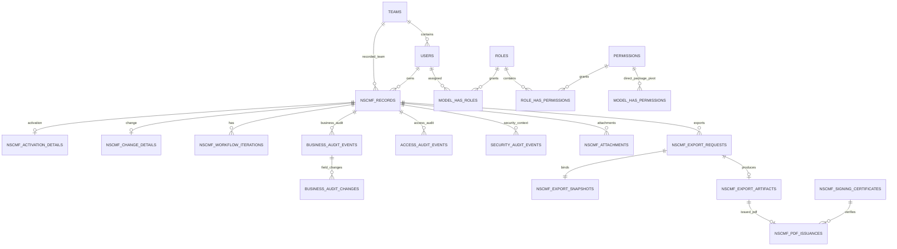

# ERD / Database Schema Specification

## NSCMF Digital Form & Workflow System

> **Document ID:** NSCMF-ERD-011  
> **Document Order:** 11 / 20  
> **Status:** Draft — Confirmed Database Architecture Baseline  
> **Repository:** `rezkym/nscmf_velo`  
> **Depends On:** `01_PRD.md`, `02_Business_Rules.md`, `03_User_Flow.md`, `04_RBAC_Permission_Matrix.md`, `05_State_Status_Flow.md`, `06_Validation_Rules.md`, `07_UI_UX_Specification.md`, `08_Tech_Stack_Specification.md`, `09_System_Architecture.md`, `10_Security_Rules.md`  
> **Database:** MySQL 8.4 LTS / InnoDB / `utf8mb4`  
> **Last Updated:** 2026-08-21

---

## 1. Purpose

Dokumen ini menjadi **source of truth authoritative untuk relational data model, table ownership, keys, relationships, constraints, indexes, retention classes, dan database-level integrity direction** NSCMF Digital Form & Workflow System.

Schema ini materializes decisions yang sudah dikunci pada `01–10`, terutama:

- single organization / single installation;
- organization hanya menggunakan **Team**, bukan Unit/Division;
- Team adalah organizational/profile data dan **bukan authorization scope**;
- permission-centric authorization menggunakan `spatie/laravel-permission ^8`;
- Spatie Teams feature tetap disabled;
- no duplicate RBAC schema;
- canonical seven NSCMF business states;
- Requester ownership rules;
- shared/non-exclusive Reviewer dan Approver pools;
- workflow iteration semantics;
- immutable Request No setelah first successful Submit;
- optimistic versioning untuk Draft/Revision/Result persistence;
- row-locked workflow transitions;
- typed Activation/Change form data tanpa EAV;
- append-oriented Business/Access/Security Audit separation;
- private attachment + ClamAV security metadata;
- immutable deterministic export snapshot;
- exact-template export metadata;
- Approved PDF issuance/signing verification evidence;
- generated export binary retention 168 hours / 7 days;
- no age-based purge untuk authoritative audits.

Dokumen ini tidak menentukan API payloads (`12`), class/folder placement (`13`), environment variables/server paths (`14`), coding-agent rules (`15`), atau physical deployment (`20`).

---

## 2. Normative Language

- **MUST** — mandatory.
- **MUST NOT** — forbidden.
- **SHOULD** — strong default.
- **MAY** — allowed.
- **AUTHORITATIVE** — source of truth untuk concern tersebut.
- **DERIVED** — data/output yang dibentuk dari authoritative relational state dan tidak menggantikan source of truth.
- **IMMUTABLE** — setelah berhasil dibuat, normal application flow tidak mengubah row/payload tersebut.

---

# PART A — DATABASE PRINCIPLES

## 3. Engine / Charset / Key Strategy

All application-owned relational tables MUST use:

```text
MySQL 8.4 LTS
InnoDB
utf8mb4
BIGINT UNSIGNED primary keys unless explicitly stated otherwise
```

User primary key uses Laravel-conventional `BIGINT UNSIGNED` so Spatie polymorphic pivot `model_id` can use its standard schema without UUID customization.

Business/application timestamps SHOULD use microsecond-capable timestamp/datetime columns where useful for deterministic ordering. Business dates remain `DATE` fields. Exact server/database timezone configuration is finalized in `14_Environment_Specification.md`.

## 4. Relational Source of Truth — No EAV

Known NSCMF business fields MUST be relational/typed.

Implementation MUST NOT introduce generic structures such as:

```text
nscmf_fields
nscmf_field_values
form_data JSON
activation_data JSON
change_data JSON
workflow_blob JSON
```

as the authoritative business model.

Repeatable source-template structures use explicit child tables with stable row IDs / ordered row numbers.

## 5. JSON Boundary — Strict

JSON is **not** a substitute for relational schema.

JSON is permitted only where this document explicitly allows it.

### 5.1 Business Audit Supplemental Metadata

`business_audit_events.metadata_json` MAY contain optional supplemental context only.

It MUST NOT be the authoritative location for:

- actor identity;
- NSCMF ID;
- Team membership;
- business status;
- workflow transition;
- role/permission assignment;
- archive state;
- sign-off identity;
- NSCMF business fields;
- export issuance identity.

Those facts have relational columns/tables.

### 5.2 Security Audit Supplemental Metadata

`security_audit_events.metadata_json` MAY contain optional security context that does not deserve a dedicated relational column.

It MUST NOT contain plaintext passwords, password hashes of supplied credentials, private signing keys/passphrases, secret tokens, or become the only authoritative location for actor, target user, event type, outcome, session ID, NSCMF ID, attachment ID, or export ID.

### 5.3 Immutable Export Snapshot

`nscmf_export_snapshots.snapshot_json` is an explicit separate exception.

It is allowed because it is a **DERIVED immutable serialization** of an already-authoritative relational record at export-request time. It is not editable live business data and MUST NOT be used to update the NSCMF record.

### 5.4 Framework Runtime Payloads

Framework-owned serialized/session/job payloads are infrastructure data and do not authorize use of JSON for NSCMF business fields.

## 6. One Authoritative Source Per Fact

A business fact MUST NOT have conflicting authoritative copies.

Examples:

- current NSCMF status → `nscmf_records.business_status`;
- current Team relationship for user → `users.team_id`;
- Team captured for NSCMF at creation → `nscmf_records.team_id`;
- current final Reviewed/Approved sign-off → current `nscmf_workflow_iterations` row;
- first successful Submit actor → `nscmf_records.requested_by_user_id`;
- exact issued PDF hash → `nscmf_pdf_issuances.final_pdf_sha256`.

Audit rows and immutable export/issuance evidence preserve historical facts but do not override current source-of-truth columns.

---

# PART B — HIGH-LEVEL ERD

## 7. Logical Relationship Overview



Diagram ini intentionally high level; detailed family child tables dijelaskan di bawah.

---

# PART C — IDENTITY / ORGANIZATION / RBAC

## 8. `teams` — Application-Owned

Purpose: organizational/profile master data only.

| Column | Type | Null | Notes |
|---|---|---:|---|
| `id` | BIGINT UNSIGNED PK | No | |
| `name` | VARCHAR(150) | No | Human Team name, e.g. Team NOC |
| `is_active` | BOOLEAN | No | default true |
| `created_at` | DATETIME/TIMESTAMP | No | |
| `updated_at` | DATETIME/TIMESTAMP | No | |

Constraints/indexes:

- unique Team name under application-normalized/case-insensitive comparison;
- referenced Team SHOULD be deactivated rather than deleted;
- Team MUST NOT appear in authorization pivots.

Explicitly forbidden:

```text
units
divisions
reviewer_scopes
approver_scopes
team_permission_scopes
```

## 9. `users` — Application-Owned

| Column | Type | Null | Notes |
|---|---|---:|---|
| `id` | BIGINT UNSIGNED PK | No | Spatie-compatible model ID |
| `team_id` | BIGINT UNSIGNED FK → `teams.id` | Yes | nullable for bootstrap/protected seed; normal configured user requires Team by domain rule |
| `name` | VARCHAR(150) | No | human sign-off/display identity |
| `username` | VARCHAR(150) | No | login identifier |
| `password` | VARCHAR(255) | No | secure hash only |
| `is_active` | BOOLEAN | No | default true |
| `must_change_password` | BOOLEAN | No | temporary credential gate |
| `is_protected_superadmin` | BOOLEAN | No | protected seeded identity marker |
| `password_changed_at` | DATETIME/TIMESTAMP | Yes | security/session support |
| `remember_token` | VARCHAR(100) | Yes | Laravel compatibility if used |
| `created_at` | DATETIME/TIMESTAMP | No | |
| `updated_at` | DATETIME/TIMESTAMP | No | |

Constraints/indexes:

- unique `username` using case-insensitive application rule;
- index `team_id`;
- `team_id` `ON DELETE RESTRICT`;
- password plaintext MUST never be stored;
- protected Superadmin invariants are application/domain enforced and security-tested;
- Team change does **not** revoke sessions by itself because Team is not authorization.

Normal user deletion is not a history-erasure mechanism. Actor references use `ON DELETE RESTRICT`; operationally disable accounts when referenced historical identity must remain.

A user MUST have a valid active Team before creating a new NSCMF. Bootstrap nullability exists only so the protected seed/account setup can exist before Team setup is complete.

## 10. Spatie Package-Owned Tables — MUST Reuse Standard Schema

The following tables belong to `spatie/laravel-permission ^8` and MUST NOT be recreated under alternate names:

### `roles`

Standard package fields include:

```text
id BIGINT UNSIGNED PK
name VARCHAR
guard_name VARCHAR
created_at
updated_at
UNIQUE(name, guard_name)
```

### `permissions`

```text
id BIGINT UNSIGNED PK
name VARCHAR
guard_name VARCHAR
created_at
updated_at
UNIQUE(name, guard_name)
```

### `model_has_roles`

Standard Spatie polymorphic relation:

```text
role_id
model_type
model_id BIGINT UNSIGNED
PRIMARY KEY(role_id, model_id, model_type)
```

### `model_has_permissions`

Standard Spatie polymorphic direct-permission pivot:

```text
permission_id
model_type
model_id BIGINT UNSIGNED
PRIMARY KEY(permission_id, model_id, model_type)
```

This table remains because the package owns it, but current MVP admin UI MUST NOT expose direct permission-to-user assignment.

### `role_has_permissions`

```text
permission_id
role_id
PRIMARY KEY(permission_id, role_id)
```

Package indexes/FKs MUST follow the published package migration for the installed 8.x version rather than being manually reimplemented from memory.

## 11. Spatie Configuration Constraints

Current DB design assumes:

```php
'teams' => false,
'enable_wildcard_permission' => false,
```

and a single `web` guard.

Therefore package tables MUST NOT receive Spatie Team foreign keys or Team-scoped uniqueness.

Forbidden duplicate/custom RBAC tables:

```text
user_roles
user_permissions
role_permissions
effective_permissions
reviewer_roles
approver_roles
```

`session.login` and `session.logout` MUST NOT be seeded into `permissions`.

---

# PART D — CORE NSCMF

## 12. `nscmf_records`

One row = one NSCMF record, independent of Activation/Change detail tables.

| Column | Type | Null | Notes |
|---|---|---:|---|
| `id` | BIGINT UNSIGNED PK | No | |
| `request_no` | VARCHAR(64) | No | original display casing |
| `request_no_normalized` | VARCHAR(64) | No | server-derived lower(trim) uniqueness key |
| `numbering_mode` | VARCHAR(16) | No | `AUTOMATIC` / `MANUAL` |
| `family` | VARCHAR(16) | No | `ACTIVATION` / `CHANGE` |
| `subtype` | VARCHAR(32) | No | family-valid subtype |
| `request_date` | DATE | Yes | required at Submit, nullable Draft |
| `owner_user_id` | BIGINT UNSIGNED FK → `users.id` | No | own-record authority anchor |
| `team_id` | BIGINT UNSIGNED FK → `teams.id` | No | Team captured at record creation; informational, never authorization |
| `business_status` | VARCHAR(32) | No | canonical status only |
| `record_version` | BIGINT UNSIGNED | No | optimistic concurrency token, default 1 |
| `requested_by_user_id` | BIGINT UNSIGNED FK → `users.id` | Yes | first successful Submit actor |
| `first_submitted_at` | DATETIME/TIMESTAMP | Yes | first successful Submit timestamp |
| `current_workflow_iteration_id` | BIGINT UNSIGNED FK | Yes | null before first Submit/Cancelled |
| `is_archived` | BOOLEAN | No | separate from status |
| `archived_at` | DATETIME/TIMESTAMP | Yes | current archive state metadata |
| `archived_by_user_id` | BIGINT UNSIGNED FK → `users.id` | Yes | current archive actor |
| `archive_reason` | VARCHAR(2000) / TEXT | Yes | mandatory when currently archived |
| `created_at` | DATETIME/TIMESTAMP | No | |
| `updated_at` | DATETIME/TIMESTAMP | No | |

`team_id` is captured from the owner's Team when the NSCMF is created and MUST NOT be used in authorization queries. Later user Team changes do not silently rewrite historical NSCMF Team metadata.

### 12.1 Canonical Status CHECK

Allowed values exactly:

```text
DRAFT
PENDING_REVIEW
REVISION_REQUIRED
PENDING_APPROVAL
REJECTED
APPROVED
CANCELLED
```

No other persistent business status is allowed.

### 12.2 Family/Subtype CHECK

Valid combinations:

```text
ACTIVATION → ACTIVATION | UPGRADE_DOWNGRADE | DEACTIVATION
CHANGE     → MAINTENANCE | UPGRADE | EMERGENCY
```

### 12.3 Archive CHECK

If `is_archived = true`, `business_status` MUST be one of:

```text
APPROVED
REJECTED
CANCELLED
```

Archive does not alter `business_status`.

### 12.4 Submission / Iteration Integrity

Domain/database constraints SHOULD preserve:

- `DRAFT` and `CANCELLED` have no current workflow iteration;
- all post-submit workflow states have a current workflow iteration;
- `requested_by_user_id` / `first_submitted_at` are null before first successful Submit and non-null after it;
- `CANCELLED` can only arise before first successful Submit.

The `current_workflow_iteration_id` FK is added after `nscmf_workflow_iterations` exists to avoid migration-order circularity.

### 12.5 Request Number Rules

`request_no_normalized` has a unique index.

Manual number:

- outer whitespace trimmed;
- length 3–64;
- valid characters from `06`;
- globally unique case-insensitive.

Automatic number:

```text
NSCMF-YYYYMM-#####
```

is allocated server-side once and is not regenerated by ordinary updates.

After first successful Submit, Request No is immutable. Automatic Request No is system-managed after allocation. Manual Request No may only be changed while eligible Draft rules permit it.

### 12.6 No Hard Delete

`nscmf_records` has **no `deleted_at` business deletion path** and no normal delete permission. Archive is the supported lifecycle mechanism.

## 13. Record Version Semantics — Critical

`record_version` is the single optimistic concurrency token for mutable NSCMF content.

Rules:

- Draft / Revision / Result persistence requires `expected_version`;
- successful mutation atomically increments `record_version`;
- stale expected version fails without overwrite;
- child-table mutations increment parent `nscmf_records.record_version` in the same transaction;
- workflow transitions also increment the record version while holding the row lock;
- export snapshot captures the exact `record_version` at request time.

No child table introduces an independent competing business version token unless a future explicit requirement requires it.

---

# PART E — AUTOMATIC NUMBER SEQUENCE

## 14. `nscmf_number_sequences`

| Column | Type | Null | Notes |
|---|---|---:|---|
| `year_month` | CHAR(6) PK | No | `YYYYMM` |
| `last_value` | INT UNSIGNED | No | last allocated sequence |
| `updated_at` | DATETIME/TIMESTAMP | No | |

Allocation rules:

- global monthly sequence; not split by family or Team;
- counter increment is concurrency-safe under short transaction/row lock;
- sequence gaps are allowed;
- allocated value is never reused;
- allocation must remain consumed even if a later unrelated creation step fails after allocation commitment.

---

# PART F — ACTIVATION DATA MODEL

## 15. `nscmf_activation_details`

Exactly one row for `family=ACTIVATION`.

| Column | Type | Null | Validation meaning |
|---|---|---:|---|
| `nscmf_record_id` | BIGINT UNSIGNED PK/FK | No | 1:1 |
| `customer_name` | VARCHAR(150) | Yes | required at Submit |
| `contact_name` | VARCHAR(150) | Yes | required at Submit |
| `installation_rfs_date` | DATE | Yes | subtype-dependent |
| `lan_ip_allocation` | TEXT | Yes | validated/parses IP/CIDR/ranges; canonical user-entered allocation list |
| `wan_ip` | VARCHAR(255) | Yes | IPv4/IPv6/CIDR |
| `gateway` | VARCHAR(255) | Yes | single IPv4/IPv6 |
| `pop` | VARCHAR(255) | Yes | |
| `regional` | VARCHAR(255) | Yes | |
| `preferred_upstream` | VARCHAR(255) | Yes | |
| `secondary_upstream` | VARCHAR(255) | Yes | |
| `primary_noc_link` | VARCHAR(255) | Yes | |
| `secondary_noc_link` | VARCHAR(255) | Yes | |
| `downlink_router` | VARCHAR(255) | Yes | |
| `bandwidth_international_mbps` | DECIMAL(14,3) | Yes | >0 if present |
| `bandwidth_domestic_iix_mbps` | DECIMAL(14,3) | Yes | >0 if present |
| `bandwidth_mixed_mbps` | DECIMAL(14,3) | Yes | >0 if present |
| `domain_name_1` | VARCHAR(253) | Yes | FQDN |
| `domain_name_2` | VARCHAR(253) | Yes | FQDN |
| `primary_dns` | VARCHAR(255) | Yes | IP |
| `secondary_dns` | VARCHAR(255) | Yes | IP |
| `mx_primary` | VARCHAR(255) | Yes | FQDN or priority + FQDN |
| `mx_secondary` | VARCHAR(255) | Yes | FQDN or priority + FQDN |
| `hosting_platform` | VARCHAR(255) | Yes | dependency-controlled |
| `hosting_capacity_gb` | DECIMAL(14,3) | Yes | >0 if present |
| `migrate_domain` | BOOLEAN | No | default false |
| `migrate_hosting` | BOOLEAN | No | default false |
| `created_at` | DATETIME/TIMESTAMP | No | |
| `updated_at` | DATETIME/TIMESTAMP | No | |

Draft fields remain nullable; `06` owns action-stage requiredness. `lan_ip_allocation` is a named typed business column, not EAV/JSON; backend still validates each parsed item before persistence.

## 16. `nscmf_activation_references`

Optional multi-select reference values.

| Column | Type | Null |
|---|---|---:|
| `id` | BIGINT UNSIGNED PK | No |
| `nscmf_record_id` | BIGINT UNSIGNED FK | No |
| `reference_type` | VARCHAR(16) | No |
| `specification` | VARCHAR(255) | Yes |

Allowed `reference_type`:

```text
IWO
VELOSHIP
TICKET
OTHER
```

Constraints:

- unique `(nscmf_record_id, reference_type)`;
- `OTHER` requires `specification` at applicable validation stage.

## 17. `nscmf_activation_service_blocks`

Stores Existing/New Service as explicit repeatable semantic blocks.

| Column | Type | Null |
|---|---|---:|
| `id` | BIGINT UNSIGNED PK | No |
| `nscmf_record_id` | BIGINT UNSIGNED FK | No |
| `service_context` | VARCHAR(16) | No |
| `service_id` | VARCHAR(100) | Yes |
| `service_status` | VARCHAR(16) | Yes |
| `service_description` | VARCHAR(2000) / TEXT | Yes |
| `service_location` | VARCHAR(500) | Yes |
| `created_at` | DATETIME/TIMESTAMP | No |
| `updated_at` | DATETIME/TIMESTAMP | No |

`service_context`:

```text
EXISTING
NEW
```

`service_status` if present:

```text
ACTIVATED
DEACTIVATED
```

Unique `(nscmf_record_id, service_context)` ensures maximum one Existing and one New block.

## 18. `nscmf_activation_sla_items`

Max 3 ordered SLA/specific requirement entries.

```text
id BIGINT PK
nscmf_record_id FK
row_no TINYINT UNSIGNED CHECK 1..3
requirement_text VARCHAR(1000)
UNIQUE(nscmf_record_id, row_no)
```

## 19. `nscmf_activation_virtual_connections`

Custom bandwidth `VC#1`–`VC#3`.

```text
id BIGINT PK
nscmf_record_id FK
row_no TINYINT UNSIGNED CHECK 1..3
bandwidth_mbps DECIMAL(14,3) NULL CHECK >0 when present
UNIQUE(nscmf_record_id, row_no)
```

## 20. `nscmf_activation_priority_destinations`

```text
id BIGINT PK
nscmf_record_id FK
row_no TINYINT UNSIGNED CHECK 1..3
destination VARCHAR(255)
UNIQUE(nscmf_record_id, row_no)
```

## 21. `nscmf_activation_direct_site_details`

Optional Customer Site Direct technical data, 1:1 with Activation record.

| Column | Type | Null |
|---|---|---:|
| `nscmf_record_id` | BIGINT UNSIGNED PK/FK | No |
| `local_loops` | VARCHAR(255) | Yes |
| `lastmile` | VARCHAR(255) | Yes |
| `bwa` | VARCHAR(255) | Yes |
| `antenna_tower` | VARCHAR(255) | Yes |
| `direction` | VARCHAR(255) | Yes |
| `rssi` | DECIMAL(12,3) | Yes |
| `latency_ms` | DECIMAL(14,3) | Yes |
| `packet_loss_percent` | DECIMAL(5,2) | Yes |
| `routers` | VARCHAR(255) | Yes |
| `ups` | VARCHAR(255) | Yes |
| `stabilizer` | VARCHAR(255) | Yes |
| `cable` | VARCHAR(255) | Yes |
| `created_at` | DATETIME/TIMESTAMP | No |
| `updated_at` | DATETIME/TIMESTAMP | No |

Checks:

- latency >= 0;
- packet loss 0..100;
- no invented RSSI range.

## 22. `nscmf_activation_pop_site_details`

Optional Customer Site at POP data, 1:1.

| Column | Type | Null |
|---|---|---:|
| `nscmf_record_id` | BIGINT UNSIGNED PK/FK | No |
| `switch_distribution` | VARCHAR(255) | Yes |
| `port` | VARCHAR(255) | Yes |
| `vlan_id` | SMALLINT UNSIGNED | Yes |
| `local_loops` | VARCHAR(255) | Yes |
| `routers` | VARCHAR(255) | Yes |
| `cpe_indoor` | VARCHAR(255) | Yes |
| `cpe_outdoor` | VARCHAR(255) | Yes |
| `created_at` | DATETIME/TIMESTAMP | No |
| `updated_at` | DATETIME/TIMESTAMP | No |

`vlan_id` CHECK `1..4094` when present.

---

# PART G — CHANGE DATA MODEL

## 23. `nscmf_change_details`

Exactly one row for `family=CHANGE`.

| Column | Type | Null | Notes |
|---|---|---:|---|
| `nscmf_record_id` | BIGINT UNSIGNED PK/FK | No | 1:1 |
| `maintenance_purpose` | VARCHAR(4000) / TEXT | Yes | subtype-dependent |
| `target_execution_date` | DATE | Yes | required at Submit |
| `monitoring_period_value` | DECIMAL(14,3) | Yes | >0 when applicable |
| `monitoring_period_unit` | VARCHAR(32) | Yes | normalized duration unit; current recommended minute/hour/day/week |
| `rollback_scenario` | VARCHAR(4000) / TEXT | Yes | required at Submit |
| `announcement_timing` | VARCHAR(40) | Yes | exactly one at Submit |
| `created_at` | DATETIME/TIMESTAMP | No | |
| `updated_at` | DATETIME/TIMESTAMP | No | |

`announcement_timing` canonical values:

```text
ONE_WEEK_BEFORE
TWO_WEEKS_BEFORE
TWO_DAYS_BEFORE_EMERGENCY
```

Subtype-specific requiredness remains in `06`, not forced on incomplete Draft rows.

## 24. `nscmf_change_facing_challenges`

```text
id BIGINT PK
nscmf_record_id FK
row_no TINYINT UNSIGNED CHECK 1..3
challenge_text VARCHAR(1000)
UNIQUE(nscmf_record_id, row_no)
```

## 25. `nscmf_change_identified_problems`

```text
id BIGINT PK
nscmf_record_id FK
row_no TINYINT UNSIGNED CHECK 1..3
problem_text VARCHAR(1000)
UNIQUE(nscmf_record_id, row_no)
```

## 26. `nscmf_change_service_impacts`

| Column | Type | Null |
|---|---|---:|
| `id` | BIGINT UNSIGNED PK | No |
| `nscmf_record_id` | BIGINT UNSIGNED FK | No |
| `impact_code` | VARCHAR(16) | No |
| `other_description` | VARCHAR(500) | Yes |

Allowed values exactly:

```text
NOC15
NOC23
NOC361
REGIONAL
POP
CUSTOMER
OTHER
```

Constraints:

- unique `(nscmf_record_id, impact_code)`;
- `OTHER` requires description at Submit/Resubmit;
- these values are service-impact form values, **not Team values and not authorization scope**.

## 27. `nscmf_change_improvement_items`

Paired Improvement Plan / Target KPI rows.

```text
id BIGINT PK
nscmf_record_id FK
row_no TINYINT UNSIGNED CHECK 1..3
plan_text VARCHAR(1000) NULL
target_kpi VARCHAR(1000) NULL
UNIQUE(nscmf_record_id, row_no)
```

Applicable action validation ensures a started row is complete and minimum one complete pair exists at Submit/Resubmit.

## 28. `nscmf_change_results`

Up to 5 ordered Result of Changes rows.

| Column | Type | Null |
|---|---|---:|
| `id` | BIGINT UNSIGNED PK | No |
| `nscmf_record_id` | BIGINT UNSIGNED FK | No |
| `row_no` | TINYINT UNSIGNED | No |
| `result_summary` | VARCHAR(2000) / TEXT | Yes |
| `performance_information` | VARCHAR(2000) / TEXT | Yes |
| `result_status` | VARCHAR(255) | Yes |
| `created_at` | DATETIME/TIMESTAMP | No |
| `updated_at` | DATETIME/TIMESTAMP | No |

Constraints:

- `row_no` CHECK 1..5;
- unique `(nscmf_record_id, row_no)`;
- zero rows allowed on first Submit;
- any started row complete at Submit/Resubmit;
- minimum one complete row before Reviewer Forward;
- Result mutation during `PENDING_REVIEW` increments parent `record_version` and is ownership/permission constrained;
- this table MUST NOT contain/generalize planning fields.

---

# PART H — WORKFLOW ITERATIONS / SIGN-OFF

## 29. Iteration Rule — Confirmed

```text
First successful Submit              → Iteration 1
Return / Revision / Resubmit         → same iteration
Approver Return Reviewer/Requester   → same iteration
Approved or Rejected → Reopen        → new iteration
```

No new iteration is created merely by viewing, reviewing, autosaving, resubmitting, exporting, archiving, or unarchiving.

## 30. `nscmf_workflow_iterations`

| Column | Type | Null | Meaning |
|---|---|---:|---|
| `id` | BIGINT UNSIGNED PK | No | |
| `nscmf_record_id` | BIGINT UNSIGNED FK | No | parent |
| `iteration_no` | INT UNSIGNED | No | starts at 1 |
| `predecessor_iteration_id` | BIGINT UNSIGNED self-FK | Yes | null for Iteration 1 |
| `started_via` | VARCHAR(16) | No | `FIRST_SUBMIT` / `REOPEN` |
| `started_by_user_id` | BIGINT UNSIGNED FK → `users.id` | No | Submit/Reopen actor |
| `started_at` | DATETIME(6) | No | |
| `reviewed_by_user_id` | BIGINT UNSIGNED FK → `users.id` | Yes | current-iteration successful Forward actor |
| `reviewed_at` | DATETIME(6) | Yes | current effective Review sign-off |
| `approved_by_user_id` | BIGINT UNSIGNED FK → `users.id` | Yes | successful final Approve actor |
| `approved_at` | DATETIME(6) | Yes | |
| `closed_status` | VARCHAR(16) | Yes | `APPROVED` / `REJECTED` only |
| `closed_at` | DATETIME(6) | Yes | terminal closure of iteration |
| `superseded_at` | DATETIME(6) | Yes | set if a later Reopen creates successor iteration |
| `created_at` | DATETIME/TIMESTAMP | No | |
| `updated_at` | DATETIME/TIMESTAMP | No | |

Constraints:

- unique `(nscmf_record_id, iteration_no)`;
- `iteration_no >= 1`;
- predecessor belongs to same record (domain invariant + tests);
- `closed_status` only `APPROVED`/`REJECTED`;
- `approved_by_user_id`/`approved_at` only when closed Approved;
- exactly one current iteration is referenced by `nscmf_records.current_workflow_iteration_id` after first Submit.

## 31. Sign-Off Semantics

### Requested By

```text
nscmf_records.requested_by_user_id
nscmf_records.first_submitted_at
```

= actor/timestamp of **first successful Submit**. It is not overwritten by Reopen.

### Reviewed By

```text
current workflow iteration.reviewed_by_user_id
current workflow iteration.reviewed_at
```

= actor/timestamp of the successful Forward that is currently effective for that iteration.

If Approver returns to Reviewer or Requester, current `reviewed_by_*` MUST be cleared because a fresh successful Forward is required. Historical Forward remains in Business Audit.

### Approved By

```text
current/historical workflow iteration.approved_by_user_id
approved_at
```

= actor that successfully commits `PENDING_APPROVAL -> APPROVED`.

No exclusive Approver assignment table exists. One successful eligible approval closes the iteration; stale subsequent actions fail current-state revalidation.

## 32. No Reviewer Assignment Ownership Table

There is intentionally no:

```text
nscmf_review_assignments
nscmf_approver_assignments
reviewer_owner_id
approver_owner_id
```

Multiple Reviewer contributors are represented through Business Audit events. Opening a record creates neither assignment nor ownership.

---

# PART I — BUSINESS AUDIT — HYBRID BUT STRICT

## 33. `business_audit_events`

One row represents one authoritative business mutation/workflow/lifecycle event.

| Column | Type | Null |
|---|---|---:|
| `id` | BIGINT UNSIGNED PK | No |
| `nscmf_record_id` | BIGINT UNSIGNED FK | No |
| `workflow_iteration_id` | BIGINT UNSIGNED FK | Yes |
| `actor_user_id` | BIGINT UNSIGNED FK → `users.id` | Yes |
| `actor_type` | VARCHAR(16) | No |
| `event_type` | VARCHAR(64) | No |
| `from_status` | VARCHAR(32) | Yes |
| `to_status` | VARCHAR(32) | Yes |
| `reason` | VARCHAR(2000) / TEXT | Yes |
| `comment` | VARCHAR(2000) / TEXT | Yes |
| `record_version_before` | BIGINT UNSIGNED | Yes |
| `record_version_after` | BIGINT UNSIGNED | Yes |
| `metadata_json` | JSON | Yes |
| `occurred_at` | DATETIME(6) | No |

`actor_type` current values:

```text
USER
SYSTEM
```

If `USER`, `actor_user_id` is required. System-managed event may use null actor user with `actor_type=SYSTEM`.

Typical `event_type` examples are explicit application constants such as:

```text
RECORD_CREATED
DRAFT_UPDATED
SUBMITTED
RESULT_UPDATED
REVIEW_FORWARDED
REVIEW_RETURNED
REVIEW_REJECTED
APPROVAL_RETURNED_REVIEWER
APPROVAL_RETURNED_REQUESTER
APPROVAL_REJECTED
APPROVED
REOPENED
CANCELLED
ARCHIVED
UNARCHIVED
ATTACHMENT_ADDED
ATTACHMENT_REMOVED
```

Event vocabulary is finalized/locked in implementation documents but MUST not create extra NSCMF statuses.

## 34. `business_audit_changes`

Normalized field-level changes associated with one event.

| Column | Type | Null |
|---|---|---:|
| `id` | BIGINT UNSIGNED PK | No |
| `business_audit_event_id` | BIGINT UNSIGNED FK | No |
| `field_path` | VARCHAR(255) | No |
| `value_kind` | VARCHAR(32) | Yes |
| `old_value_text` | LONGTEXT | Yes |
| `new_value_text` | LONGTEXT | Yes |

Examples of stable field paths:

```text
activation.customer_name
activation.service.NEW.service_id
change.service_impacts.OTHER
change.results.<row-id>.result_status
record.request_date
```

`old_value_text` / `new_value_text` are audit evidence representations, not live source-of-truth values.

## 35. Hybrid Audit Guardrails — Critical

`metadata_json` MAY contain context such as:

```text
source = autosave
client_context = form-editor
```

It MUST NOT hide required relational facts or duplicate authoritative current fields.

Forbidden anti-pattern:

```json
{
  "status": "APPROVED",
  "approved_by": 17,
  "team_id": 3,
  "requester_id": 9
}
```

when those facts are already modeled relationally.

Business Audit rows are append-oriented. Normal application code MUST NOT update/delete historical events or changes.

---

# PART J — ACCESS AUDIT / SECURITY AUDIT

## 36. `access_audit_events`

Separate from Business Audit/Timeline.

| Column | Type | Null |
|---|---|---:|
| `id` | BIGINT UNSIGNED PK | No |
| `actor_user_id` | BIGINT UNSIGNED FK → `users.id` | No |
| `event_type` | VARCHAR(64) | No |
| `nscmf_record_id` | BIGINT UNSIGNED FK | Yes |
| `attachment_id` | BIGINT UNSIGNED FK | Yes |
| `export_request_id` | BIGINT UNSIGNED FK | Yes |
| `occurred_at` | DATETIME(6) | No |

Typical event types:

```text
RECORD_VIEWED
ATTACHMENT_VIEWED
ATTACHMENT_DOWNLOADED
EXPORT_REQUESTED
EXPORT_DOWNLOADED
PRIVILEGED_AUDIT_VIEWED
```

No routine Access Audit event becomes a Business Timeline row.

## 37. `security_audit_events`

| Column | Type | Null |
|---|---|---:|
| `id` | BIGINT UNSIGNED PK | No |
| `actor_user_id` | BIGINT UNSIGNED FK → `users.id` | Yes |
| `target_user_id` | BIGINT UNSIGNED FK → `users.id` | Yes |
| `subject_username` | VARCHAR(150) | Yes |
| `event_type` | VARCHAR(64) | No |
| `outcome` | VARCHAR(16) | No |
| `session_id` | VARCHAR(255) | Yes |
| `ip_address` | VARCHAR(45) | Yes |
| `nscmf_record_id` | BIGINT UNSIGNED FK | Yes |
| `attachment_id` | BIGINT UNSIGNED FK | Yes |
| `export_request_id` | BIGINT UNSIGNED FK | Yes |
| `metadata_json` | JSON | Yes |
| `occurred_at` | DATETIME(6) | No |

Typical security events include login failure/throttling, credential reset, temporary-password replacement, role changes, permission changes, session revocation, account enable/disable, malware outcomes, signing readiness/failure, privileged security-audit access.

`outcome` current normalized set SHOULD use explicit values such as:

```text
SUCCESS
FAILURE
DENIED
ERROR
```

Security `metadata_json` follows Section 5.2 and remains supplemental only.

Passwords, hashes of supplied passwords, private keys, passphrases, secret tokens, or raw sensitive payloads MUST NOT be stored.

## 38. Authoritative Audit Retention

These tables have **no age-based application purge**:

```text
business_audit_events
business_audit_changes
access_audit_events
security_audit_events
```

Normal app code exposes no delete path.

Where operationally practical, production DB grants SHOULD prevent routine application UPDATE/DELETE on authoritative audit tables while still permitting INSERT/SELECT required by the app. Migration/administrative credentials remain separate operational concern.

---

# PART K — ATTACHMENTS / MALWARE STATE

## 39. `nscmf_attachments`

| Column | Type | Null | Notes |
|---|---|---:|---|
| `id` | BIGINT UNSIGNED PK | No | |
| `nscmf_record_id` | BIGINT UNSIGNED FK | No | |
| `uploaded_by_user_id` | BIGINT UNSIGNED FK → `users.id` | No | |
| `original_filename` | VARCHAR(255) | No | metadata only |
| `extension` | VARCHAR(16) | No | normalized |
| `detected_mime_type` | VARCHAR(150) | No | server detected |
| `size_bytes` | BIGINT UNSIGNED | No | >0; <=20MB |
| `sha256` | CHAR(64) | No | exact uploaded/accepted content hash |
| `quarantine_object_key` | VARCHAR(1024) | Yes | private only |
| `private_object_key` | VARCHAR(1024) | Yes | set only after CLEAN promotion |
| `security_status` | VARCHAR(16) | No | technical file-security state |
| `scanned_at` | DATETIME(6) | Yes | |
| `scanner_engine` | VARCHAR(100) | Yes | e.g. ClamAV |
| `removed_at` | DATETIME(6) | Yes | logical removal metadata |
| `removed_by_user_id` | BIGINT UNSIGNED FK → `users.id` | Yes | |
| `created_at` | DATETIME/TIMESTAMP | No | |
| `updated_at` | DATETIME/TIMESTAMP | No | |

Recommended `security_status` values:

```text
PENDING
CLEAN
INFECTED
FAILED
```

These are attachment technical/security values and MUST NOT become NSCMF business statuses.

Rules:

- only `CLEAN` may have normal usable `private_object_key`;
- INFECTED / timeout / unavailable / scanner error never become usable;
- scanner-specific diagnostic detail belongs Security Audit/technical logs and must be sanitized;
- attachment max count 10 active files/record is enforced transactionally by domain validation;
- logical removal preserves metadata/audit evidence while storage cleanup may remove binary according to allowed attachment lifecycle;
- private object key is never sufficient authorization.

Allowed extensions remain exactly from `06`.

---

# PART L — TEMPLATE / IMMUTABLE EXPORT SNAPSHOT

## 40. `nscmf_template_versions`

Metadata for immutable official XLSX template versions.

| Column | Type | Null |
|---|---|---:|
| `id` | BIGINT UNSIGNED PK | No |
| `version_label` | VARCHAR(50) | No |
| `private_object_key` | VARCHAR(1024) | No |
| `template_sha256` | CHAR(64) | No |
| `mapping_version` | VARCHAR(100) | No |
| `is_active` | BOOLEAN | No |
| `created_at` | DATETIME/TIMESTAMP | No |

Constraints:

- unique `version_label`;
- unique template SHA-256 where appropriate;
- template binary is immutable after registration;
- old template metadata remains available for historical export/issuance traceability;
- targeted OOXML mapping itself may live in version-controlled application configuration/code, but `mapping_version` identifies which mapping contract was used.

## 41. `nscmf_export_batches`

Minimal grouping for bulk export initiation; **does not define ZIP/combined-PDF packaging**.

| Column | Type | Null |
|---|---|---:|
| `id` | BIGINT UNSIGNED PK | No |
| `requested_by_user_id` | BIGINT UNSIGNED FK → `users.id` | No |
| `format` | VARCHAR(8) | No |
| `created_at` | DATETIME/TIMESTAMP | No |

Format:

```text
XLSX
PDF
```

Exact bulk packaging remains TBD downstream. Each selected record still receives its own deterministic export request/snapshot.

## 42. `nscmf_export_requests`

| Column | Type | Null |
|---|---|---:|
| `id` | BIGINT UNSIGNED PK | No |
| `nscmf_record_id` | BIGINT UNSIGNED FK | No |
| `requested_by_user_id` | BIGINT UNSIGNED FK → `users.id` | No |
| `export_batch_id` | BIGINT UNSIGNED FK → `nscmf_export_batches.id` | Yes |
| `format` | VARCHAR(8) | No |
| `status` | VARCHAR(16) | No |
| `requested_at` | DATETIME(6) | No |
| `started_at` | DATETIME(6) | Yes |
| `ready_at` | DATETIME(6) | Yes |
| `failed_at` | DATETIME(6) | Yes |
| `expires_at` | DATETIME(6) | Yes |
| `failure_code` | VARCHAR(100) | Yes |
| `failure_summary` | VARCHAR(1000) | Yes |

Technical status values:

```text
QUEUED
PROCESSING
READY
FAILED
EXPIRED
```

These MUST NOT appear as NSCMF business statuses.

## 43. `nscmf_export_snapshots` — Immutable

Exactly one snapshot per export request.

| Column | Type | Null |
|---|---|---:|
| `id` | BIGINT UNSIGNED PK | No |
| `export_request_id` | BIGINT UNSIGNED FK | No |
| `nscmf_record_id` | BIGINT UNSIGNED FK | No |
| `record_version` | BIGINT UNSIGNED | No |
| `workflow_iteration_id` | BIGINT UNSIGNED FK | Yes |
| `template_version_id` | BIGINT UNSIGNED FK | No |
| `snapshot_schema_version` | VARCHAR(50) | No |
| `snapshot_json` | JSON | No |
| `snapshot_sha256` | CHAR(64) | No |
| `created_at` | DATETIME(6) | No |

Constraints:

- unique `export_request_id`;
- row and `snapshot_json` are immutable after successful creation;
- `snapshot_sha256` is computed over canonical serialized snapshot representation;
- worker reads the snapshot, not live NSCMF child tables, to determine exported content;
- snapshot contains only the version-bound data needed for exact export/sign-off representation;
- snapshot is DERIVED evidence, not editable business source of truth.

## 44. Snapshot Creation Transaction

Export request + snapshot binding occurs synchronously before queue dispatch:

```text
authorize
→ BEGIN short transaction
→ read current relational data consistently
→ create export request row with QUEUED technical status
→ bind record_version
→ bind workflow iteration
→ bind template version
→ create canonical immutable snapshot linked to export_request_id
→ COMMIT
→ dispatch queue job after commit
```

If the transaction fails, neither the export request nor snapshot is committed. Worker MUST NOT rebuild the snapshot from later live data.

---

# PART M — EXPORT ARTIFACT / APPROVED PDF ISSUANCE

## 45. `nscmf_export_artifacts`

One final user-facing artifact per successful export request.

| Column | Type | Null |
|---|---|---:|
| `id` | BIGINT UNSIGNED PK | No |
| `export_request_id` | BIGINT UNSIGNED FK | No |
| `private_object_key` | VARCHAR(1024) | Yes |
| `mime_type` | VARCHAR(100) | No |
| `size_bytes` | BIGINT UNSIGNED | No |
| `artifact_sha256` | CHAR(64) | No |
| `created_at` | DATETIME(6) | No |
| `expires_at` | DATETIME(6) | No |
| `binary_purged_at` | DATETIME(6) | Yes |

Constraints:

- unique `export_request_id`;
- `expires_at = created/ready time + 168 hours` under current rule;
- scheduler removes generated binary after expiry but artifact metadata row MAY remain;
- cleanup sets `binary_purged_at` and must not delete source/audit/issuance metadata.

Intermediate workbook/PDF rendering files are private temporary workspace artifacts and are not READY artifacts.

## 46. `nscmf_signing_certificates` — Public Verification Material Only

Historical public signer/certificate registry.

| Column | Type | Null |
|---|---|---:|
| `id` | BIGINT UNSIGNED PK | No |
| `certificate_label` | VARCHAR(150) | No |
| `fingerprint_sha256` | CHAR(64) | No |
| `serial_number` | VARCHAR(255) | Yes |
| `subject_dn` | VARCHAR(1000) | Yes |
| `valid_from` | DATETIME/TIMESTAMP | Yes |
| `valid_until` | DATETIME/TIMESTAMP | Yes |
| `material_format` | VARCHAR(32) | Yes |
| `public_certificate_material` | MEDIUMTEXT | Yes |
| `is_active` | BOOLEAN | No |
| `created_at` | DATETIME/TIMESTAMP | No |
| `retired_at` | DATETIME/TIMESTAMP | Yes |

Unique `fingerprint_sha256`.

**There is intentionally no private-key column.**

Private signing key/passphrase is manually provisioned in protected server/environment storage per `10`. This table stores/resolves only public verification material required to preserve historical validation after key rotation. Exact certificate/key container used by the signer remains an Environment/Deployment decision.

## 47. `nscmf_pdf_issuances`

Created only after successful Approved PDF signing.

| Column | Type | Null |
|---|---|---:|
| `id` | BIGINT UNSIGNED PK | No |
| `export_request_id` | BIGINT UNSIGNED FK | No |
| `export_artifact_id` | BIGINT UNSIGNED FK | No |
| `nscmf_record_id` | BIGINT UNSIGNED FK | No |
| `export_snapshot_id` | BIGINT UNSIGNED FK | No |
| `workflow_iteration_id` | BIGINT UNSIGNED FK | No |
| `signing_certificate_id` | BIGINT UNSIGNED FK → `nscmf_signing_certificates.id` | No |
| `final_pdf_sha256` | CHAR(64) | No |
| `issued_at` | DATETIME(6) | No |

Constraints:

- unique `export_request_id`;
- unique `export_artifact_id`;
- index `final_pdf_sha256` for validator lookup;
- issuance row persists beyond 7-day binary cleanup;
- human Approved By remains authoritative on the referenced workflow iteration / bound snapshot and is not duplicated as a second mutable source here;
- final hash is over **final signed PDF bytes**, not unsigned/intermediate PDF.

## 48. Public Validator Currentness

Do not persist a second mutable `is_current` truth on issuance rows.

Currentness is resolved from authoritative relational context:

```text
recognized certificate/signature
+ exact final_pdf_sha256 match
+ known issuance/snapshot
+ issuance workflow_iteration_id
+ current NSCMF workflow iteration/status
```

Result:

- same genuine issuance tied to current Approved iteration → `VALID_CURRENT`;
- genuine issuance tied to a superseded historical iteration → `VALID_SUPERSEDED`;
- invalid modified bytes/signature/hash → `INVALID_MODIFIED`;
- unrecognized issuance → `UNKNOWN`.

This avoids currentness drift between an issuance flag and live workflow state.

---

# PART N — LARAVEL RUNTIME TABLES

## 49. `sessions`

Use Laravel database session table as framework-owned runtime storage.

Standard fields include conceptually:

```text
id
user_id
ip_address
user_agent
payload
last_activity
```

Current security policy additionally requires an explicit absolute-session anchor. The application migration SHOULD extend the DB session representation with:

```text
authenticated_at DATETIME/TIMESTAMP NULL
```

with the domain invariant that authenticated user sessions (`user_id` non-null) receive `authenticated_at`. This supports the 8-hour absolute lifetime without relying only on `last_activity` and does not force anonymous/public session rows to fabricate an authentication timestamp.

Session rows may be deleted during logout/revocation; Security Audit preserves required revocation evidence.

Indexes:

- `user_id`;
- `last_activity`;
- `authenticated_at` where useful for expiry cleanup.

## 50. Queue / Cache Tables

Laravel framework-owned runtime tables use standard migrations as appropriate:

```text
jobs
job_batches
failed_jobs
cache
cache_locks
```

These tables are technical/runtime state and MUST NOT be joined conceptually with NSCMF business status.

Queue/job payloads are not business source of truth. A failed/removed job must not erase the export request/snapshot/audit evidence.

---

# PART O — FOREIGN KEY / DELETE POLICY

## 51. Referential Integrity Direction

Business/history entities use foreign keys wherever a stable relational target exists.

High-level delete policy:

- `nscmf_records` → no normal application delete;
- authoritative audit rows → no normal application update/delete;
- workflow iterations → historical, no normal delete;
- PDF issuance/certificate verification history → retained;
- Team/user actor rows referenced by history → `ON DELETE RESTRICT`;
- package role/permission FK behavior follows official Spatie migrations;
- generated binary cleanup updates artifact metadata rather than deleting NSCMF source/history;
- public validator temporary upload is short-lived storage and does not become a normal relational attachment.

Avoid `ON DELETE SET NULL` for authoritative human sign-off identity because actor history must remain resolvable. Disable/deactivate user instead of erasing referenced identity.

---

# PART P — INDEX STRATEGY

## 52. Required / High-Value Indexes

### Identity

```text
users(username) UNIQUE
users(team_id)
teams(name) UNIQUE normalized
```

### NSCMF

```text
nscmf_records(request_no_normalized) UNIQUE
nscmf_records(owner_user_id, business_status)
nscmf_records(business_status, is_archived)
nscmf_records(family, subtype)
nscmf_records(team_id)
nscmf_records(request_date)
nscmf_records(created_at)
```

### Workflow

```text
nscmf_workflow_iterations(nscmf_record_id, iteration_no) UNIQUE
nscmf_workflow_iterations(nscmf_record_id, closed_status)
nscmf_workflow_iterations(approved_at)
```

### Audit

```text
business_audit_events(nscmf_record_id, occurred_at)
business_audit_events(actor_user_id, occurred_at)
business_audit_events(event_type, occurred_at)
business_audit_changes(business_audit_event_id)
access_audit_events(actor_user_id, occurred_at)
access_audit_events(nscmf_record_id, occurred_at)
security_audit_events(event_type, occurred_at)
security_audit_events(actor_user_id, occurred_at)
security_audit_events(target_user_id, occurred_at)
```

### Attachment

```text
nscmf_attachments(nscmf_record_id, removed_at)
nscmf_attachments(security_status)
nscmf_attachments(sha256)
```

### Export / Validation

```text
nscmf_export_requests(nscmf_record_id, requested_at)
nscmf_export_requests(requested_by_user_id, requested_at)
nscmf_export_requests(status, requested_at)
nscmf_export_requests(expires_at)
nscmf_export_snapshots(export_request_id) UNIQUE
nscmf_export_artifacts(export_request_id) UNIQUE
nscmf_export_artifacts(expires_at, binary_purged_at)
nscmf_pdf_issuances(final_pdf_sha256)
nscmf_pdf_issuances(nscmf_record_id, workflow_iteration_id)
nscmf_signing_certificates(fingerprint_sha256) UNIQUE
```

Actual composite-index tuning MUST be based on query plans and target 50-user workload; do not add speculative index explosion.

---

# PART Q — CONSTRAINTS NOT FULLY EXPRESSIBLE WITH SIMPLE CHECKS

## 53. Domain-Enforced Invariants

Some rules require transactional/domain logic rather than isolated row CHECK constraints.

These MUST be enforced by Laravel domain actions + tests:

- actor owns record for Requester mutations;
- Team never affects Review/Approval authorization;
- owner must have a valid active Team when creating NSCMF;
- record Team is captured at creation and does not auto-follow later user Team changes;
- max 10 active attachments;
- first Submit creates Iteration 1 exactly once;
- Reopen creates next iteration only from Approved/Rejected;
- predecessor iteration belongs same record;
- `current_workflow_iteration_id` matches record;
- stale workflow actor loses race after another transition;
- one final Approve per current iteration;
- Approver return clears current effective Review sign-off;
- Request No immutable after first Submit;
- automatic numbers never reused;
- action-stage required/conditional form validation;
- row parent family matches detail table family;
- Result-only mutation cannot touch planning fields;
- export snapshot assembled from one consistent record version;
- Approved PDF issuance only after mandatory signing succeeds;
- final issuance hash corresponds to final signed bytes;
- audit write required by atomic business transition succeeds in same transaction.

DB triggers are **not** the default business-rule mechanism. Prefer explicit domain/application actions with transaction tests.

---

# PART R — TRANSACTION BOUNDARIES

## 54. Draft / Revision / Result Save

Conceptual transaction:

```text
BEGIN
SELECT/UPDATE nscmf_records
  WHERE id=? AND record_version=expected_version

validate ownership/state/permission
persist typed parent/child changes
insert Business Audit event + field changes
increment record_version
COMMIT
```

Zero matched version → explicit optimistic conflict; no overwrite.

## 55. Workflow Transition

Conceptual:

```text
BEGIN
SELECT nscmf_records ... FOR UPDATE
re-check required permission
re-check current state/archive/business/security rules
perform transition / iteration mutation
insert Business Audit event
increment record_version
COMMIT
```

Do not hold lock while scanning files, rendering XLSX/PDF, signing PDF, waiting for user interaction, or running queue work.

## 56. Role / Permission Mutation

Spatie remains authorization source of truth.

Application service wraps package mutation:

```text
current-password re-auth
→ protected invariant check
→ Spatie role/permission mutation
→ determine affected users
→ revoke affected target sessions
→ Security Audit
```

Do not create a shadow effective-permissions table.

Team assignment mutation is separate organizational metadata and does not trigger authorization recalculation/session revocation by itself.

---

# PART S — RETENTION CLASSES

## 57. Permanent / No Age-Based Purge

No age-based automatic deletion:

```text
nscmf_records and relational form data
nscmf_workflow_iterations
business_audit_events / changes
access_audit_events
security_audit_events
nscmf_pdf_issuances
historical public certificate verification material needed for issued PDFs
```

## 58. Temporary Generated Export Binary

```text
READY XLSX/PDF binary
→ 168 hours / 7 days
→ scheduled binary cleanup
```

Metadata/audit/issuance persists.

## 59. Technical Logs / Runtime Rows

Technical logs, expired sessions, cache, queue runtime data have separate operational lifecycle. They MUST NOT inherit the authoritative-audit retention rule automatically.

---

# PART T — DATA INTEGRITY / AI IMPLEMENTATION GUARDRAILS

## 60. Developer / AI MUST NOT

Implementation MUST NOT:

1. create Unit or Division tables;
2. create Reviewer Scope / Approval Scope tables;
3. use Team as authorization scope;
4. enable Spatie Teams;
5. add `team_id` to Spatie permission pivots;
6. duplicate Spatie `roles`, `permissions`, or pivot schema under custom names;
7. remove/repurpose `model_has_permissions` just because direct-user permission UI is disabled;
8. create `session.login` or `session.logout` Spatie permissions;
9. enable wildcard permissions;
10. create an `effective_permissions` cache/source-of-truth table;
11. store live Activation/Change fields inside JSON blobs;
12. use EAV for known form fields;
13. hide authoritative actor/status/Team/workflow facts in audit JSON;
14. duplicate current authoritative values inside audit `metadata_json` as a competing truth;
15. put secrets/passwords/private keys in Security Audit metadata JSON;
16. mutate immutable export snapshot after creation;
17. let export worker read newer live record data instead of snapshot;
18. store private signing key/passphrase in DB;
19. store signing private key inside certificate registry;
20. delete issuance metadata when 7-day binary expires;
21. make export/scan/session/validator technical status an NSCMF business status;
22. add permanent Reviewer/Approver assignment ownership;
23. hard-delete NSCMF as normal lifecycle;
24. age-purge Business/Access/Security Audit;
25. use public object path as authorization;
26. store plaintext password or credential payload in audit;
27. classify Team change as permission/access-scope mutation;
28. implement Superadmin as generic bypass of invalid domain state;
29. introduce DB triggers as hidden workflow engine without an explicit specification change.

## 61. JSON Exception Is Not General Permission

The existence of:

```text
business_audit_events.metadata_json
security_audit_events.metadata_json
nscmf_export_snapshots.snapshot_json
Laravel session/job payloads
```

MUST NOT be interpreted as permission to move typed business schema into JSON.

---

# PART U — TESTABLE DATABASE ACCEPTANCE

## 62. Schema / RBAC

- [ ] MySQL 8.4/InnoDB/utf8mb4 baseline.
- [ ] `users.id` compatible with Spatie standard polymorphic pivots.
- [ ] package tables reused, no duplicate RBAC schema.
- [ ] Spatie Teams disabled and no package Team FK present.
- [ ] business Team separate from permissions.
- [ ] direct-user permission UI not required while package pivot remains.
- [ ] wildcard permission feature disabled.

## 63. NSCMF Core

- [ ] only seven canonical business statuses accepted.
- [ ] family/subtype valid combinations enforced.
- [ ] Request No normalized global unique.
- [ ] monthly automatic sequence concurrency-safe.
- [ ] record has owner and Team-at-creation metadata.
- [ ] creating actor must have configured active Team.
- [ ] Team does not participate in Reviewer/Approver query eligibility.
- [ ] later user Team changes do not rewrite historical NSCMF Team metadata.
- [ ] no NSCMF hard-delete path.
- [ ] archive is separate from status.
- [ ] optimistic `record_version` exists.

## 64. Family Data

- [ ] Activation and Change use typed tables.
- [ ] repeatable max-3/max-5 structures have row number constraints.
- [ ] Service Impact uses relational multi-select rows.
- [ ] Other impact description supported.
- [ ] Result of Changes max five rows and no separate business state.
- [ ] no EAV/form-data JSON authority.

## 65. Workflow / Sign-Off

- [ ] first Submit creates Iteration 1.
- [ ] Return/Revision/Resubmit stays same iteration.
- [ ] Reopen after Approved/Rejected creates next iteration.
- [ ] first Requested By remains historical first Submit actor.
- [ ] current Reviewed By comes from effective Forward in current iteration.
- [ ] one successful final Approved By stored on iteration.
- [ ] old iteration remains historical/supersedable.
- [ ] no exclusive Reviewer/Approver assignment table.

## 66. Audit

- [ ] Business/Access/Security Audit are physically separate.
- [ ] Business field diffs normalized under `business_audit_changes`.
- [ ] Business/Security audit metadata JSON only supplemental.
- [ ] no age-based audit purge.
- [ ] historical audit not normally update/delete capable.

## 67. Attachment / Security

- [ ] attachment private metadata includes server-detected type/size/hash.
- [ ] non-CLEAN file cannot have usable normal artifact semantics.
- [ ] max 10 active attachments enforced transactionally.
- [ ] removal preserves history/evidence.

## 68. Export / PDF Trust

- [ ] export request binds immutable snapshot at request time.
- [ ] snapshot stores record version, workflow iteration, template version.
- [ ] worker does not re-read later state for exported business content.
- [ ] generated binary expires after 168h while metadata remains.
- [ ] PDF issuance stores exact final signed SHA-256.
- [ ] human Approved By remains authoritative on workflow iteration, not duplicated as a mutable issuance truth.
- [ ] public certificate history is resolvable.
- [ ] DB contains no signing private key.
- [ ] current/superseded is resolved from issuance + workflow context, not drifting mutable flag.

## 69. Session / Runtime

- [ ] DB sessions support 30m idle and explicit 8h absolute anchor.
- [ ] target-session revocation is possible by `user_id`.
- [ ] queue/cache/session technical tables remain separate from business schema.

---

# PART V — DOWNSTREAM HANDOFF

## 70. `12_API_Contract.md`

Must define request/response behavior consistent with this schema, including:

- expected `record_version` and conflict response;
- permission/state action endpoints;
- Team administration without scope semantics;
- explicit role/permission admin boundaries through Spatie;
- attachment upload/scan/download behavior;
- export request/status/download;
- immutable snapshot semantics hidden from unsafe client mutation;
- public PDF validation result payload;
- safe error semantics.

## 71. `13_Project_Structure.md`

Must place domain actions/services so schema mutations are not scattered across controllers/models/jobs.

## 72. `14_Environment_Specification.md`

Must configure MySQL, sessions, queue, storage, template location, ClamAV, renderer, signing identity, public certificates, and scheduler without storing secrets in DB/source.

## 73. `15_Coding_Rules_AGENTS.md`

Must repeat the critical schema guardrails, especially:

```text
NO EAV
NO live business JSON blobs
NO Unit/Division
NO Reviewer/Approval Scope
NO Spatie Teams
NO duplicate RBAC schema
NO direct-user permission admin UI MVP
NO wildcard permissions
NO private signing key in DB
NO authoritative fact duplication inside audit metadata JSON
```

## 74. `16_Testing_Specification.md`

Must test DB constraints, optimistic conflicts, workflow races, package alignment, audit immutability, attachment security, deterministic snapshot binding, issuance hashes, and retention boundaries.

---

# PART W — INTENTIONALLY DEFERRED / NOT INVENTED HERE

## 75. Remaining Downstream/TBD Details

This ERD intentionally does not invent:

- official company numbering SOP beyond current provisional format;
- exact initial Team master names beyond examples;
- generic organizational hierarchy;
- Team-based authorization;
- direct-user permission feature;
- exact API DTO/error/status codes;
- exact physical certificate/private-key server path;
- exact signing library/container format/provider/CA;
- exact public-validator disclosure payload;
- exact bulk export packaging/ZIP semantics;
- additional export formats beyond XLSX/PDF;
- technical-log retention;
- notification tables/provider before notification capability is approved;
- backup/restore/DR/RPO/RTO;
- performance/SLA/availability target.

No future TBD may silently override the confirmed schema boundaries above.

---

# PART X — FINAL CONSISTENCY STATEMENTS

## 76. Team vs Authorization

> Team answers **where a user belongs organizationally**. Permission answers **what the user may attempt to do**. State, ownership where explicitly required, validation, security, and concurrency determine whether the action is valid now.

There is no Team authorization scope.

## 77. Spatie Boundary

> Spatie is the authoritative Role/Permission primitive and database schema provider. NSCMF does not build a second RBAC subsystem beside it.

## 78. Audit Hybrid Boundary

> Relational columns/child rows hold authoritative audit identity and field-change structure. JSON metadata is supplemental only and MUST NOT become a hidden database inside an audit row.

## 79. Export Snapshot Boundary

> Immutable export snapshot is a derived serialized copy created at export request time so queued workers cannot accidentally export a later record version. It is not a replacement for the relational NSCMF model.

## 80. Signed PDF Historical Trust

> The database stores public certificate/issuance/hash evidence required for validation, but never the private signing key. A genuine old signed PDF can remain authentic while becoming `VALID_SUPERSEDED` after a later workflow iteration.

---

## 81. Next Document

Next document in the fixed project sequence:

**`12_API_Contract.md`**

It MUST expose HTTP/application contracts that preserve this ERD, permission-centric authorization, immutable snapshot behavior, concurrency semantics, and security boundaries without reintroducing scope or duplicate business truth.
