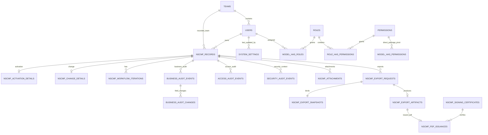

# ERD / Database Schema Specification

## NSCMF Digital Form & Workflow System

> **Document ID:** NSCMF-ERD-011  
> **Document Order:** 11 / 20  
> **Status:** Approved for Implementation  
> **Repository:** `rezkym/nscmf_velo`  
> **Depends On:** `01_PRD.md`, `02_Business_Rules.md`, `03_User_Flow.md`, `04_RBAC_Permission_Matrix.md`, `05_State_Status_Flow.md`, `06_Validation_Rules.md`, `07_UI_UX_Specification.md`, `08_Tech_Stack_Specification.md`, `09_System_Architecture.md`, `10_Security_Rules.md`  
> **Synchronized With:** `11A_Resumable_Attachment_Upload_Synchronization.md` and `14_Environment_Specification.md`  
> **Database:** MySQL 8.4 LTS / InnoDB / `utf8mb4`  
> **Canonical Application Timezone:** `Asia/Jakarta`  
> **Last Updated:** 2026-09-02  

---

## 1. Purpose

Dokumen ini menjadi **source of truth authoritative untuk relational data model, table ownership, keys, relationships, constraints, indexes, retention classes, dan database-level integrity direction** NSCMF Digital Form & Workflow System.

Schema ini materializes decisions yang sudah dikunci pada `01–10`, terutama:

- single organization / single installation;
- organization hanya menggunakan **Team**, bukan Unit/Division;
- Team adalah organizational/profile data dan **bukan authorization scope**;
- permission-centric authorization menggunakan `spatie/laravel-permission ^8`;
- Spatie Teams feature tetap disabled;
- no duplicate RBAC schema;
- canonical seven NSCMF business states;
- Requester ownership rules;
- shared/non-exclusive Reviewer dan Approver pools;
- workflow iteration semantics;
- immutable Request No setelah first successful Submit;
- optimistic versioning untuk Draft/Revision/Result persistence;
- row-locked workflow transitions;
- typed Activation/Change form data tanpa EAV;
- append-oriented Business/Access/Security Audit separation;
- private attachment + resumable-upload + ClamAV security metadata;
- immutable deterministic export snapshot;
- exact-template export metadata;
- Approved PDF issuance/signing verification evidence;
- generated export binary retention 168 hours / 7 days;
- no age-based purge untuk authoritative audits;
- protected typed Technical Log cleanup setting, distinct from authoritative audit retention;
- server-generated temporary-password flow has no plaintext credential persistence requirement;
- initial production binary storage uses persistent Laravel private local filesystem; database stores private storage references/keys, not a public object-storage authorization mechanism.

Dokumen ini tidak menentukan API payloads (`12`), class/folder placement (`13`), exact environment variables/server paths (`14`), coding-agent rules (`15`), atau physical deployment (`20`).

---

## 2. Normative Language

- **MUST** — mandatory.
- **MUST NOT** — forbidden.
- **SHOULD** — strong default.
- **MAY** — allowed.
- **AUTHORITATIVE** — source of truth untuk concern tersebut.
- **DERIVED** — data/output yang dibentuk dari authoritative relational state dan tidak menggantikan source of truth.
- **IMMUTABLE** — setelah berhasil dibuat, normal application flow tidak mengubah row/payload tersebut.

---

# PART A — DATABASE PRINCIPLES

## 3. Engine / Charset / Key Strategy

All application-owned relational tables MUST use:

```text
MySQL 8.4 LTS
InnoDB
utf8mb4
BIGINT UNSIGNED primary keys unless explicitly stated otherwise
```

User primary key uses Laravel-conventional `BIGINT UNSIGNED` so Spatie polymorphic pivot `model_id` can use its standard schema without UUID customization.

Business/application timestamps SHOULD use microsecond-capable timestamp/datetime columns where useful for deterministic ordering. Business dates remain `DATE` fields.

Canonical application/business timezone is **`Asia/Jakarta`**. `14_Environment_Specification.md` remains authority for the exact MySQL connection/session/server timestamp strategy so persisted values, API ISO-8601 offsets, scheduler, logs, and issuance timestamps are interpreted consistently.

## 4. Relational Source of Truth — No EAV

Known NSCMF business fields MUST be relational/typed.

Implementation MUST NOT introduce generic structures such as:

```text
nscmf_fields
nscmf_field_values
form_data JSON
activation_data JSON
change_data JSON
workflow_blob JSON
```

as the authoritative business model.

Repeatable source-template structures use explicit child tables with stable row IDs / ordered row numbers.

## 5. JSON Boundary — Strict

JSON is **not** a substitute for relational schema.

JSON is permitted only where this document explicitly allows it.

### 5.1 Business Audit Supplemental Metadata

`business_audit_events.metadata_json` MAY contain optional supplemental context only.

It MUST NOT be the authoritative location for actor identity, NSCMF ID, Team membership, business status, workflow transition, role/permission assignment, archive state, sign-off identity, NSCMF business fields, or export issuance identity.

### 5.2 Security Audit Supplemental Metadata

`security_audit_events.metadata_json` MAY contain optional security context that does not deserve a dedicated relational column.

It MUST NOT contain plaintext passwords, password hashes of supplied credentials, temporary-password plaintext, private signing keys/passphrases, secret tokens, or become the only authoritative location for actor, target user, event type, outcome, session ID, NSCMF ID, attachment ID, export ID, or protected-setting mutation identity.

### 5.3 Immutable Export Snapshot

`nscmf_export_snapshots.snapshot_json` is an explicit separate exception.

It is allowed because it is a **DERIVED immutable serialization** of an already-authoritative relational record at export-request time. It is not editable live business data and MUST NOT be used to update the NSCMF record.

### 5.4 Framework Runtime Payloads

Framework-owned serialized/session/job payloads are infrastructure data and do not authorize use of JSON for NSCMF business fields.

### 5.5 No Generic Settings EAV

The fact that the application has protected configurable Technical Log cleanup MUST NOT be used to introduce a generic key/value or JSON settings database such as:

```text
settings(key, value)
system_settings.settings_json
config_values
```

for arbitrary product/security rules.

Current configurable runtime setting is modeled with typed columns in a bounded singleton table defined in Part C.

## 6. One Authoritative Source Per Fact

A business/security configuration fact MUST NOT have conflicting authoritative copies.

Examples:

- current NSCMF status → `nscmf_records.business_status`;
- current Team relationship for user → `users.team_id`;
- Team captured for NSCMF at creation → `nscmf_records.team_id`;
- current final Reviewed/Approved sign-off → current `nscmf_workflow_iterations` row;
- first successful Submit actor → `nscmf_records.requested_by_user_id`;
- exact issued PDF hash → `nscmf_pdf_issuances.final_pdf_sha256`;
- Technical Log automatic-cleanup preference → typed `system_settings` columns.

Audit rows and immutable export/issuance evidence preserve historical facts but do not override current source-of-truth columns.

---

# PART B — HIGH-LEVEL ERD

## 7. Logical Relationship Overview



Diagram ini intentionally high level; resumable-upload tables remain synchronized through `11A` and detailed family child tables dijelaskan di bawah.

---

# PART C — IDENTITY / ORGANIZATION / RBAC / SETTINGS

## 8. `teams` — Application-Owned

Purpose: organizational/profile master data only.

| Column | Type | Null | Notes |
|---|---|---:|---|
| `id` | BIGINT UNSIGNED PK | No | |
| `name` | VARCHAR(150) | No | Human Team name, e.g. Team NOC |
| `is_active` | BOOLEAN | No | default true |
| `created_at` | DATETIME/TIMESTAMP | No | |
| `updated_at` | DATETIME/TIMESTAMP | No | |

Constraints/indexes:

- unique Team name under application-normalized/case-insensitive comparison;
- referenced Team SHOULD be deactivated rather than deleted;
- Team MUST NOT appear in authorization pivots.

Explicitly forbidden:

```text
units
divisions
reviewer_scopes
approver_scopes
team_permission_scopes
```

## 9. `users` — Application-Owned

| Column | Type | Null | Notes |
|---|---|---:|---|
| `id` | BIGINT UNSIGNED PK | No | Spatie-compatible model ID |
| `team_id` | BIGINT UNSIGNED FK → `teams.id` | Yes | nullable for bootstrap/protected seed; normal configured user requires Team by domain rule |
| `name` | VARCHAR(150) | No | human sign-off/display identity |
| `username` | VARCHAR(150) | No | login identifier |
| `password` | VARCHAR(255) | No | secure hash only |
| `is_active` | BOOLEAN | No | default true |
| `must_change_password` | BOOLEAN | No | temporary credential gate |
| `is_protected_superadmin` | BOOLEAN | No | protected seeded identity marker |
| `password_changed_at` | DATETIME/TIMESTAMP | Yes | security/session support |
| `remember_token` | VARCHAR(100) | Yes | Laravel compatibility if used |
| `created_at` | DATETIME/TIMESTAMP | No | |
| `updated_at` | DATETIME/TIMESTAMP | No | |

Constraints/indexes:

- unique `username` using case-insensitive application rule;
- index `team_id`;
- `team_id` `ON DELETE RESTRICT`;
- password plaintext MUST never be stored;
- temporary password plaintext MUST never receive its own DB column;
- protected Superadmin invariants are application/domain enforced and security-tested;
- Team change does **not** revoke sessions by itself because Team is not authorization.

Normal user deletion is not a history-erasure mechanism. Actor references use `ON DELETE RESTRICT`; operationally disable accounts when referenced historical identity must remain.

A user MUST have a valid active Team before creating a new NSCMF. Bootstrap nullability exists only so the protected seed/account setup can exist before Team setup is complete.

## 10. Spatie Package-Owned Tables — MUST Reuse Standard Schema

The following tables belong to `spatie/laravel-permission ^8` and MUST NOT be recreated under alternate names:

### `roles`

```text
id BIGINT UNSIGNED PK
name VARCHAR
guard_name VARCHAR
created_at
updated_at
UNIQUE(name, guard_name)
```

### `permissions`

```text
id BIGINT UNSIGNED PK
name VARCHAR
guard_name VARCHAR
created_at
updated_at
UNIQUE(name, guard_name)
```

### `model_has_roles`

```text
role_id
model_type
model_id BIGINT UNSIGNED
PRIMARY KEY(role_id, model_id, model_type)
```

### `model_has_permissions`

```text
permission_id
model_type
model_id BIGINT UNSIGNED
PRIMARY KEY(permission_id, model_id, model_type)
```

This table remains because the package owns it, but current MVP admin UI MUST NOT expose direct permission-to-user assignment.

### `role_has_permissions`

```text
permission_id
role_id
PRIMARY KEY(permission_id, role_id)
```

Package indexes/FKs MUST follow the published package migration for the installed 8.x version rather than being manually reimplemented from memory.

## 11. Spatie Configuration Constraints

Current DB design assumes:

```php
'teams' => false,
'enable_wildcard_permission' => false,
```

and a single `web` guard.

Therefore package tables MUST NOT receive Spatie Team foreign keys or Team-scoped uniqueness.

Forbidden duplicate/custom RBAC tables:

```text
user_roles
user_permissions
role_permissions
effective_permissions
reviewer_roles
approver_roles
```

`session.login` and `session.logout` MUST NOT be seeded into `permissions`.

## 12. `system_settings` — Application-Owned Singleton, Typed

Purpose: persist the small set of approved runtime-configurable application settings that must be changed from the authenticated application UI without converting product/security rules into a generic settings engine.

Current schema:

| Column | Type | Null | Notes |
|---|---|---:|---|
| `id` | BIGINT UNSIGNED PK | No | singleton row; current application uses exactly one active row |
| `technical_log_auto_cleanup_enabled` | BOOLEAN | No | default `true` |
| `technical_log_retention_value` | INT UNSIGNED | No | default `30`; must be `>=1` |
| `technical_log_retention_unit` | VARCHAR(8) | No | `DAY` or `MONTH`; default `DAY` |
| `updated_by_user_id` | BIGINT UNSIGNED FK → `users.id` | Yes | last successful authenticated settings actor; nullable bootstrap/default |
| `created_at` | DATETIME/TIMESTAMP | No | |
| `updated_at` | DATETIME/TIMESTAMP | No | |

Constraints:

```text
technical_log_retention_value >= 1
technical_log_retention_unit IN ('DAY', 'MONTH')
```

Application invariant:

```text
exactly one effective system_settings row
```

Mutation rules:

- Protected Superadmin only;
- requires `system.settings.manage` under current RBAC mapping;
- requires valid sensitive re-authentication proof according to Security Rules;
- Security Audit records mutation without storing secret values;
- changing these fields NEVER changes authoritative Business/Access/Security Audit retention;
- turning cleanup OFF does not require clearing the retention value/unit; last configured values remain available for re-enable;
- no fixed maximum retention value at product-policy level.

Forbidden expansions without approved specification change:

```text
settings(key,value)
JSON settings blob
generic arbitrary environment override table
Business/Access/Security audit retention columns
password policy overrides
MFA toggle
business-state configuration
attachment-limit override
export-retention override
```

---

# PART D — CORE NSCMF

## 13. `nscmf_records`

One row = one NSCMF record, independent of Activation/Change detail tables.

| Column | Type | Null | Notes |
|---|---|---:|---|
| `id` | BIGINT UNSIGNED PK | No | |
| `request_no` | VARCHAR(64) | No | original display casing |
| `request_no_normalized` | VARCHAR(64) | No | server-derived lower(trim) uniqueness key |
| `numbering_mode` | VARCHAR(16) | No | `AUTOMATIC` / `MANUAL` |
| `family` | VARCHAR(16) | No | `ACTIVATION` / `CHANGE` |
| `subtype` | VARCHAR(32) | No | family-valid subtype |
| `request_date` | DATE | Yes | required at Submit, nullable Draft |
| `owner_user_id` | BIGINT UNSIGNED FK → `users.id` | No | own-record authority anchor |
| `team_id` | BIGINT UNSIGNED FK → `teams.id` | No | Team captured at record creation; informational, never authorization |
| `business_status` | VARCHAR(32) | No | canonical status only |
| `record_version` | BIGINT UNSIGNED | No | optimistic concurrency token, default 1 |
| `requested_by_user_id` | BIGINT UNSIGNED FK → `users.id` | Yes | first successful Submit actor |
| `first_submitted_at` | DATETIME/TIMESTAMP | Yes | first successful Submit timestamp |
| `current_workflow_iteration_id` | BIGINT UNSIGNED FK | Yes | null before first Submit/Cancelled |
| `is_archived` | BOOLEAN | No | separate from status |
| `archived_at` | DATETIME/TIMESTAMP | Yes | current archive state metadata |
| `archived_by_user_id` | BIGINT UNSIGNED FK → `users.id` | Yes | current archive actor |
| `archive_reason` | VARCHAR(2000) / TEXT | Yes | mandatory when currently archived |
| `created_at` | DATETIME/TIMESTAMP | No | |
| `updated_at` | DATETIME/TIMESTAMP | No | |

`team_id` is captured from the owner's Team when the NSCMF is created and MUST NOT be used in authorization queries. Later user Team changes do not silently rewrite historical NSCMF Team metadata.

### 13.1 Canonical Status CHECK

Allowed values exactly:

```text
DRAFT
PENDING_REVIEW
REVISION_REQUIRED
PENDING_APPROVAL
REJECTED
APPROVED
CANCELLED
```

No other persistent business status is allowed.

### 13.2 Family/Subtype CHECK

```text
ACTIVATION → ACTIVATION | UPGRADE_DOWNGRADE | DEACTIVATION
CHANGE     → MAINTENANCE | UPGRADE | EMERGENCY
```

### 13.3 Archive CHECK

If `is_archived = true`, `business_status` MUST be one of:

```text
APPROVED
REJECTED
CANCELLED
```

Archive does not alter `business_status`.

### 13.4 Submission / Iteration Integrity

Domain/database constraints SHOULD preserve:

- `DRAFT` and `CANCELLED` have no current workflow iteration;
- all post-submit workflow states have a current workflow iteration;
- `requested_by_user_id` / `first_submitted_at` are null before first successful Submit and non-null after it;
- `CANCELLED` can only arise before first successful Submit.

The `current_workflow_iteration_id` FK is added after `nscmf_workflow_iterations` exists to avoid migration-order circularity.

### 13.5 Request Number Rules

`request_no_normalized` has a unique index.

Manual number:

- outer whitespace trimmed;
- length 3–64;
- valid characters from `06`;
- globally unique case-insensitive.

Automatic number:

```text
NSCMF-YYYYMM-#####
```

is allocated server-side once and is not regenerated by ordinary updates.

After first successful Submit, Request No is immutable.

### 13.6 No Hard Delete

`nscmf_records` has **no `deleted_at` business deletion path** and no normal delete permission. Archive is the supported lifecycle mechanism.

## 14. Record Version Semantics — Critical

`record_version` is the single optimistic concurrency token for mutable NSCMF content.

Rules:

- Draft / Revision / Result persistence requires `expected_version`;
- successful mutation atomically increments `record_version`;
- stale expected version fails without overwrite;
- child-table mutations increment parent `nscmf_records.record_version` in the same transaction;
- workflow transitions also increment the record version while holding the row lock;
- export snapshot captures the exact `record_version` at request time.

No child table introduces an independent competing business version token unless a future explicit requirement requires it.

---

# PART E — AUTOMATIC NUMBER SEQUENCE

## 15. `nscmf_number_sequences`

| Column | Type | Null | Notes |
|---|---|---:|---|
| `year_month` | CHAR(6) PK | No | `YYYYMM` |
| `last_value` | INT UNSIGNED | No | last allocated sequence |
| `updated_at` | DATETIME/TIMESTAMP | No | |

Allocation rules:

- global monthly sequence; not split by family or Team;
- counter increment is concurrency-safe under short transaction/row lock;
- sequence gaps are allowed;
- allocated value is never reused;
- allocation must remain consumed even if a later unrelated creation step fails after allocation commitment.

---

# PART F — ACTIVATION DATA MODEL

## 16. `nscmf_activation_details`

Exactly one row for `family=ACTIVATION`.

| Column | Type | Null | Validation meaning |
|---|---|---:|---|
| `nscmf_record_id` | BIGINT UNSIGNED PK/FK | No | 1:1 |
| `customer_name` | VARCHAR(150) | Yes | required at Submit |
| `contact_name` | VARCHAR(150) | Yes | required at Submit |
| `installation_rfs_date` | DATE | Yes | subtype-dependent |
| `lan_ip_allocation` | TEXT | Yes | validated/parses IP/CIDR/ranges |
| `wan_ip` | VARCHAR(255) | Yes | IPv4/IPv6/CIDR |
| `gateway` | VARCHAR(255) | Yes | single IPv4/IPv6 |
| `pop` | VARCHAR(255) | Yes | |
| `regional` | VARCHAR(255) | Yes | |
| `preferred_upstream` | VARCHAR(255) | Yes | |
| `secondary_upstream` | VARCHAR(255) | Yes | |
| `primary_noc_link` | VARCHAR(255) | Yes | |
| `secondary_noc_link` | VARCHAR(255) | Yes | |
| `downlink_router` | VARCHAR(255) | Yes | |
| `bandwidth_international_mbps` | DECIMAL(14,3) | Yes | >0 if present |
| `bandwidth_domestic_iix_mbps` | DECIMAL(14,3) | Yes | >0 if present |
| `bandwidth_mixed_mbps` | DECIMAL(14,3) | Yes | >0 if present |
| `domain_name_1` | VARCHAR(253) | Yes | FQDN |
| `domain_name_2` | VARCHAR(253) | Yes | FQDN |
| `primary_dns` | VARCHAR(255) | Yes | IP |
| `secondary_dns` | VARCHAR(255) | Yes | IP |
| `mx_primary` | VARCHAR(255) | Yes | FQDN or priority + FQDN |
| `mx_secondary` | VARCHAR(255) | Yes | FQDN or priority + FQDN |
| `hosting_platform` | VARCHAR(255) | Yes | dependency-controlled |
| `hosting_capacity_gb` | DECIMAL(14,3) | Yes | >0 if present |
| `migrate_domain` | BOOLEAN | No | default false |
| `migrate_hosting` | BOOLEAN | No | default false |
| `created_at` | DATETIME/TIMESTAMP | No | |
| `updated_at` | DATETIME/TIMESTAMP | No | |

Draft fields remain nullable; `06` owns action-stage requiredness.

## 17. `nscmf_activation_references`

Optional multi-select reference values.

| Column | Type | Null |
|---|---|---:|
| `id` | BIGINT UNSIGNED PK | No |
| `nscmf_record_id` | BIGINT UNSIGNED FK | No |
| `reference_type` | VARCHAR(16) | No |
| `specification` | VARCHAR(255) | Yes |

Allowed `reference_type`:

```text
IWO
VELOSHIP
TICKET
OTHER
```

Unique `(nscmf_record_id, reference_type)`; `OTHER` requires `specification` at applicable validation stage.

## 18. `nscmf_activation_service_blocks`

| Column | Type | Null |
|---|---|---:|
| `id` | BIGINT UNSIGNED PK | No |
| `nscmf_record_id` | BIGINT UNSIGNED FK | No |
| `service_context` | VARCHAR(16) | No |
| `service_id` | VARCHAR(100) | Yes |
| `service_status` | VARCHAR(16) | Yes |
| `service_description` | VARCHAR(2000) / TEXT | Yes |
| `service_location` | VARCHAR(500) | Yes |
| `created_at` | DATETIME/TIMESTAMP | No |
| `updated_at` | DATETIME/TIMESTAMP | No |

`service_context`: `EXISTING|NEW`.

`service_status` if present: `ACTIVATED|DEACTIVATED`.

Unique `(nscmf_record_id, service_context)`.

## 19. `nscmf_activation_sla_items`

```text
id BIGINT PK
nscmf_record_id FK
row_no TINYINT UNSIGNED CHECK 1..3
requirement_text VARCHAR(1000)
UNIQUE(nscmf_record_id, row_no)
```

## 20. `nscmf_activation_virtual_connections`

```text
id BIGINT PK
nscmf_record_id FK
row_no TINYINT UNSIGNED CHECK 1..3
bandwidth_mbps DECIMAL(14,3) NULL CHECK >0 when present
UNIQUE(nscmf_record_id, row_no)
```

## 21. `nscmf_activation_priority_destinations`

```text
id BIGINT PK
nscmf_record_id FK
row_no TINYINT UNSIGNED CHECK 1..3
destination VARCHAR(255)
UNIQUE(nscmf_record_id, row_no)
```

## 22. `nscmf_activation_direct_site_details`

Optional Customer Site Direct technical data, 1:1 with Activation record.

| Column | Type | Null |
|---|---|---:|
| `nscmf_record_id` | BIGINT UNSIGNED PK/FK | No |
| `local_loops` | VARCHAR(255) | Yes |
| `lastmile` | VARCHAR(255) | Yes |
| `bwa` | VARCHAR(255) | Yes |
| `antenna_tower` | VARCHAR(255) | Yes |
| `direction` | VARCHAR(255) | Yes |
| `rssi` | DECIMAL(12,3) | Yes |
| `latency_ms` | DECIMAL(14,3) | Yes |
| `packet_loss_percent` | DECIMAL(5,2) | Yes |
| `routers` | VARCHAR(255) | Yes |
| `ups` | VARCHAR(255) | Yes |
| `stabilizer` | VARCHAR(255) | Yes |
| `cable` | VARCHAR(255) | Yes |
| `created_at` | DATETIME/TIMESTAMP | No |
| `updated_at` | DATETIME/TIMESTAMP | No |

Checks: latency >=0; packet loss 0..100; no invented RSSI range.

## 23. `nscmf_activation_pop_site_details`

Optional Customer Site at POP data, 1:1.

| Column | Type | Null |
|---|---|---:|
| `nscmf_record_id` | BIGINT UNSIGNED PK/FK | No |
| `switch_distribution` | VARCHAR(255) | Yes |
| `port` | VARCHAR(255) | Yes |
| `vlan_id` | SMALLINT UNSIGNED | Yes |
| `local_loops` | VARCHAR(255) | Yes |
| `routers` | VARCHAR(255) | Yes |
| `cpe_indoor` | VARCHAR(255) | Yes |
| `cpe_outdoor` | VARCHAR(255) | Yes |
| `created_at` | DATETIME/TIMESTAMP | No |
| `updated_at` | DATETIME/TIMESTAMP | No |

`vlan_id` CHECK `1..4094` when present.

---

# PART G — CHANGE DATA MODEL

## 24. `nscmf_change_details`

Exactly one row for `family=CHANGE`.

| Column | Type | Null | Notes |
|---|---|---:|---|
| `nscmf_record_id` | BIGINT UNSIGNED PK/FK | No | 1:1 |
| `maintenance_purpose` | VARCHAR(4000) / TEXT | Yes | subtype-dependent |
| `target_execution_date` | DATE | Yes | required at Submit |
| `monitoring_period_value` | DECIMAL(14,3) | Yes | >0 when applicable |
| `monitoring_period_unit` | VARCHAR(32) | Yes | normalized duration unit |
| `rollback_scenario` | VARCHAR(4000) / TEXT | Yes | required at Submit |
| `announcement_timing` | VARCHAR(40) | Yes | exactly one at Submit |
| `created_at` | DATETIME/TIMESTAMP | No | |
| `updated_at` | DATETIME/TIMESTAMP | No | |

`announcement_timing` values:

```text
ONE_WEEK_BEFORE
TWO_WEEKS_BEFORE
TWO_DAYS_BEFORE_EMERGENCY
```

## 25. `nscmf_change_facing_challenges`

```text
id BIGINT PK
nscmf_record_id FK
row_no TINYINT UNSIGNED CHECK 1..3
challenge_text VARCHAR(1000)
UNIQUE(nscmf_record_id, row_no)
```

## 26. `nscmf_change_identified_problems`

```text
id BIGINT PK
nscmf_record_id FK
row_no TINYINT UNSIGNED CHECK 1..3
problem_text VARCHAR(1000)
UNIQUE(nscmf_record_id, row_no)
```

## 27. `nscmf_change_service_impacts`

| Column | Type | Null |
|---|---|---:|
| `id` | BIGINT UNSIGNED PK | No |
| `nscmf_record_id` | BIGINT UNSIGNED FK | No |
| `impact_code` | VARCHAR(16) | No |
| `other_description` | VARCHAR(500) | Yes |

Allowed values exactly:

```text
NOC15
NOC23
NOC361
REGIONAL
POP
CUSTOMER
OTHER
```

Unique `(nscmf_record_id, impact_code)`; `OTHER` requires description at Submit/Resubmit. These values are business form values, not authorization Team values.

## 28. `nscmf_change_improvement_items`

```text
id BIGINT PK
nscmf_record_id FK
row_no TINYINT UNSIGNED CHECK 1..3
plan_text VARCHAR(1000) NULL
target_kpi VARCHAR(1000) NULL
UNIQUE(nscmf_record_id, row_no)
```

## 29. `nscmf_change_results`

Up to 5 ordered Result of Changes rows.

| Column | Type | Null |
|---|---|---:|
| `id` | BIGINT UNSIGNED PK | No |
| `nscmf_record_id` | BIGINT UNSIGNED FK | No |
| `row_no` | TINYINT UNSIGNED | No |
| `result_summary` | VARCHAR(2000) / TEXT | Yes |
| `performance_information` | VARCHAR(2000) / TEXT | Yes |
| `result_status` | VARCHAR(255) | Yes |
| `created_at` | DATETIME/TIMESTAMP | No |
| `updated_at` | DATETIME/TIMESTAMP | No |

Constraints:

- `row_no` CHECK 1..5;
- unique `(nscmf_record_id, row_no)`;
- zero rows allowed on first Submit;
- any started row complete at Submit/Resubmit;
- minimum one complete row before Reviewer Forward;
- Result mutation during `PENDING_REVIEW` increments parent `record_version` and is ownership/permission constrained;
- this table MUST NOT contain/generalize planning fields.

---

# PART H — WORKFLOW ITERATIONS / SIGN-OFF

## 30. Iteration Rule — Confirmed

```text
First successful Submit              → Iteration 1
Return / Revision / Resubmit         → same iteration
Approver Return Reviewer/Requester   → same iteration
Approved or Rejected → Reopen        → new iteration
```

## 31. `nscmf_workflow_iterations`

| Column | Type | Null | Meaning |
|---|---|---:|---|
| `id` | BIGINT UNSIGNED PK | No | |
| `nscmf_record_id` | BIGINT UNSIGNED FK | No | parent |
| `iteration_no` | INT UNSIGNED | No | starts at 1 |
| `predecessor_iteration_id` | BIGINT UNSIGNED self-FK | Yes | null for Iteration 1 |
| `started_via` | VARCHAR(16) | No | `FIRST_SUBMIT` / `REOPEN` |
| `started_by_user_id` | BIGINT UNSIGNED FK → `users.id` | No | Submit/Reopen actor |
| `started_at` | DATETIME(6) | No | |
| `reviewed_by_user_id` | BIGINT UNSIGNED FK → `users.id` | Yes | current-iteration successful Forward actor |
| `reviewed_at` | DATETIME(6) | Yes | current effective Review sign-off |
| `approved_by_user_id` | BIGINT UNSIGNED FK → `users.id` | Yes | successful final Approve actor |
| `approved_at` | DATETIME(6) | Yes | |
| `closed_status` | VARCHAR(16) | Yes | `APPROVED` / `REJECTED` only |
| `closed_at` | DATETIME(6) | Yes | terminal closure of iteration |
| `superseded_at` | DATETIME(6) | Yes | set if a later Reopen creates successor iteration |
| `created_at` | DATETIME/TIMESTAMP | No | |
| `updated_at` | DATETIME/TIMESTAMP | No | |

Constraints:

- unique `(nscmf_record_id, iteration_no)`;
- `iteration_no >= 1`;
- predecessor belongs to same record;
- `closed_status` only `APPROVED`/`REJECTED`;
- `approved_by_user_id`/`approved_at` only when closed Approved;
- exactly one current iteration is referenced by `nscmf_records.current_workflow_iteration_id` after first Submit.

## 32. Sign-Off Semantics

### Requested By

`nscmf_records.requested_by_user_id` / `first_submitted_at` = actor/timestamp of first successful Submit and are not overwritten by Reopen.

### Reviewed By

Current workflow iteration `reviewed_by_user_id` / `reviewed_at` = actor/timestamp of currently effective successful Forward.

Approver return requiring fresh review clears current `reviewed_by_*`; historical Forward remains in Business Audit.

### Approved By

Current/historical workflow iteration `approved_by_user_id` / `approved_at` = actor successfully committing `PENDING_APPROVAL -> APPROVED`.

No exclusive Approver assignment table exists. One successful eligible approval closes the iteration; stale subsequent actions fail current-state revalidation.

## 33. No Reviewer Assignment Ownership Table

Intentionally absent:

```text
nscmf_review_assignments
nscmf_approver_assignments
reviewer_owner_id
approver_owner_id
```

Multiple Reviewer contributors are represented through Business Audit events. Opening a record creates neither assignment nor ownership.

---

# PART I — BUSINESS AUDIT — HYBRID BUT STRICT

## 34. `business_audit_events`

| Column | Type | Null |
|---|---|---:|
| `id` | BIGINT UNSIGNED PK | No |
| `nscmf_record_id` | BIGINT UNSIGNED FK | No |
| `workflow_iteration_id` | BIGINT UNSIGNED FK | Yes |
| `actor_user_id` | BIGINT UNSIGNED FK → `users.id` | Yes |
| `actor_type` | VARCHAR(16) | No |
| `event_type` | VARCHAR(64) | No |
| `from_status` | VARCHAR(32) | Yes |
| `to_status` | VARCHAR(32) | Yes |
| `reason` | VARCHAR(2000) / TEXT | Yes |
| `comment` | VARCHAR(2000) / TEXT | Yes |
| `record_version_before` | BIGINT UNSIGNED | Yes |
| `record_version_after` | BIGINT UNSIGNED | Yes |
| `metadata_json` | JSON | Yes |
| `occurred_at` | DATETIME(6) | No |

`actor_type`: `USER|SYSTEM`.

Typical explicit `event_type` examples:

```text
RECORD_CREATED
DRAFT_UPDATED
SUBMITTED
RESULT_UPDATED
REVIEW_FORWARDED
REVIEW_RETURNED
REVIEW_REJECTED
APPROVAL_RETURNED_REVIEWER
APPROVAL_RETURNED_REQUESTER
APPROVAL_REJECTED
APPROVED
REOPENED
CANCELLED
ARCHIVED
UNARCHIVED
ATTACHMENT_ADDED
ATTACHMENT_REMOVED
```

## 35. `business_audit_changes`

| Column | Type | Null |
|---|---|---:|
| `id` | BIGINT UNSIGNED PK | No |
| `business_audit_event_id` | BIGINT UNSIGNED FK | No |
| `field_path` | VARCHAR(255) | No |
| `value_kind` | VARCHAR(32) | Yes |
| `old_value_text` | LONGTEXT | Yes |
| `new_value_text` | LONGTEXT | Yes |

Business Audit rows are append-oriented. Normal application code MUST NOT update/delete historical events or changes.

---

# PART J — ACCESS AUDIT / SECURITY AUDIT

## 36. `access_audit_events`

| Column | Type | Null |
|---|---|---:|
| `id` | BIGINT UNSIGNED PK | No |
| `actor_user_id` | BIGINT UNSIGNED FK → `users.id` | No |
| `event_type` | VARCHAR(64) | No |
| `nscmf_record_id` | BIGINT UNSIGNED FK | Yes |
| `attachment_id` | BIGINT UNSIGNED FK | Yes |
| `export_request_id` | BIGINT UNSIGNED FK | Yes |
| `occurred_at` | DATETIME(6) | No |

Typical: `RECORD_VIEWED`, `ATTACHMENT_VIEWED`, `ATTACHMENT_DOWNLOADED`, `EXPORT_REQUESTED`, `EXPORT_DOWNLOADED`, `PRIVILEGED_AUDIT_VIEWED`.

No routine Access Audit event becomes a Business Timeline row.

## 37. `security_audit_events`

| Column | Type | Null |
|---|---|---:|
| `id` | BIGINT UNSIGNED PK | No |
| `actor_user_id` | BIGINT UNSIGNED FK → `users.id` | Yes |
| `target_user_id` | BIGINT UNSIGNED FK → `users.id` | Yes |
| `subject_username` | VARCHAR(150) | Yes |
| `event_type` | VARCHAR(64) | No |
| `outcome` | VARCHAR(16) | No |
| `session_id` | VARCHAR(255) | Yes |
| `ip_address` | VARCHAR(45) | Yes |
| `nscmf_record_id` | BIGINT UNSIGNED FK | Yes |
| `attachment_id` | BIGINT UNSIGNED FK | Yes |
| `export_request_id` | BIGINT UNSIGNED FK | Yes |
| `metadata_json` | JSON | Yes |
| `occurred_at` | DATETIME(6) | No |

Typical events include login failure/throttling, credential reset, temporary-password replacement, role changes, permission changes, session revocation, account enable/disable, malware outcomes, signing readiness/failure, privileged security-audit access, and protected Core Settings mutation.

`outcome`: `SUCCESS|FAILURE|DENIED|ERROR`.

Passwords, hashes of supplied passwords, temporary-password plaintext, private keys, passphrases, secret tokens, or raw sensitive payloads MUST NOT be stored.

## 38. Authoritative Audit Retention

These tables have **no age-based application purge**:

```text
business_audit_events
business_audit_changes
access_audit_events
security_audit_events
```

Normal app code exposes no delete path.

Technical Log cleanup setting in `system_settings` is explicitly prohibited from targeting these tables.

---

# PART K — ATTACHMENTS / RESUMABLE UPLOAD / MALWARE STATE

## 39. `nscmf_attachments`

| Column | Type | Null | Notes |
|---|---|---:|---|
| `id` | BIGINT UNSIGNED PK | No | |
| `nscmf_record_id` | BIGINT UNSIGNED FK | No | |
| `uploaded_by_user_id` | BIGINT UNSIGNED FK → `users.id` | No | |
| `original_filename` | VARCHAR(255) | No | metadata only |
| `extension` | VARCHAR(16) | No | normalized |
| `detected_mime_type` | VARCHAR(150) | No | server detected |
| `size_bytes` | BIGINT UNSIGNED | No | >0; <=20MB |
| `sha256` | CHAR(64) | No | authoritative final assembled content hash |
| `quarantine_object_key` | VARCHAR(1024) | Yes | private storage reference only |
| `private_object_key` | VARCHAR(1024) | Yes | set only after CLEAN promotion |
| `security_status` | VARCHAR(16) | No | technical file-security state |
| `scanned_at` | DATETIME(6) | Yes | |
| `scanner_engine` | VARCHAR(100) | Yes | e.g. ClamAV |
| `removed_at` | DATETIME(6) | Yes | logical removal metadata |
| `removed_by_user_id` | BIGINT UNSIGNED FK → `users.id` | Yes | |
| `created_at` | DATETIME/TIMESTAMP | No | |
| `updated_at` | DATETIME/TIMESTAMP | No | |

`security_status`:

```text
PENDING
CLEAN
INFECTED
FAILED
```

The historical `*_object_key` column names represent **private storage locator/reference strings**, not a requirement for S3/object storage. With the confirmed initial-production Laravel `local` disk, they hold application-relative private storage keys/paths and MUST NOT expose absolute host paths or public URLs to the client.

Only CLEAN is usable/downloadable subject to authorization.

## 40. Resumable Upload Tables

`11A_Resumable_Attachment_Upload_Synchronization.md` remains authoritative for the already-confirmed physical upload-session/chunk additions, including:

```text
nscmf_attachment_upload_sessions
nscmf_attachment_upload_chunks
```

Locked invariants:

- 5 MiB chunk size;
- 24h inactivity expiry since last newly accepted progress;
- 1-based chunk index;
- idempotent byte-identical replay;
- conflicting replay rejected;
- authoritative server final SHA-256 after assembly;
- full assembled-file ClamAV CLEAN required;
- upload transport `COMPLETED` is not attachment security `CLEAN`;
- acknowledged production chunks reside on persistent/non-ephemeral private Laravel local storage under current MVP.

A future storage backend change must not require schema/business semantic change to these references.

---

# PART L — TEMPLATE / IMMUTABLE EXPORT SNAPSHOT

## 41. `nscmf_template_versions`

| Column | Type | Null |
|---|---|---:|
| `id` | BIGINT UNSIGNED PK | No |
| `version_label` | VARCHAR(50) | No |
| `private_object_key` | VARCHAR(1024) | No |
| `template_sha256` | CHAR(64) | No |
| `mapping_version` | VARCHAR(100) | No |
| `is_active` | BOOLEAN | No |
| `created_at` | DATETIME/TIMESTAMP | No |

Constraints:

- unique `version_label`;
- unique template SHA-256 where appropriate;
- template binary immutable after registration;
- old template metadata remains available for historical export/issuance traceability;
- targeted OOXML mapping lives in version-controlled code/config and `mapping_version` identifies its contract;
- replacing the official template means creating/registering a **new version**, not overwriting old binary/metadata;
- configured binary must be hash-verified against `template_sha256` before use/readiness.

`private_object_key` remains a private Laravel Storage key and does not imply an external object-storage provider.

## 42. `nscmf_export_batches`

| Column | Type | Null |
|---|---|---:|
| `id` | BIGINT UNSIGNED PK | No |
| `requested_by_user_id` | BIGINT UNSIGNED FK → `users.id` | No |
| `format` | VARCHAR(8) | No |
| `created_at` | DATETIME/TIMESTAMP | No |

Format: `XLSX|PDF`.

Exact bulk packaging remains TBD downstream.

## 43. `nscmf_export_requests`

| Column | Type | Null |
|---|---|---:|
| `id` | BIGINT UNSIGNED PK | No |
| `nscmf_record_id` | BIGINT UNSIGNED FK | No |
| `requested_by_user_id` | BIGINT UNSIGNED FK → `users.id` | No |
| `export_batch_id` | BIGINT UNSIGNED FK → `nscmf_export_batches.id` | Yes |
| `format` | VARCHAR(8) | No |
| `status` | VARCHAR(16) | No |
| `requested_at` | DATETIME(6) | No |
| `started_at` | DATETIME(6) | Yes |
| `ready_at` | DATETIME(6) | Yes |
| `failed_at` | DATETIME(6) | Yes |
| `expires_at` | DATETIME(6) | Yes |
| `failure_code` | VARCHAR(100) | Yes |
| `failure_summary` | VARCHAR(1000) | Yes |

Technical statuses:

```text
QUEUED
PROCESSING
READY
FAILED
EXPIRED
```

## 44. `nscmf_export_snapshots` — Immutable

| Column | Type | Null |
|---|---|---:|
| `id` | BIGINT UNSIGNED PK | No |
| `export_request_id` | BIGINT UNSIGNED FK | No |
| `nscmf_record_id` | BIGINT UNSIGNED FK | No |
| `record_version` | BIGINT UNSIGNED | No |
| `workflow_iteration_id` | BIGINT UNSIGNED FK | Yes |
| `template_version_id` | BIGINT UNSIGNED FK | No |
| `snapshot_schema_version` | VARCHAR(50) | No |
| `snapshot_json` | JSON | No |
| `snapshot_sha256` | CHAR(64) | No |
| `created_at` | DATETIME(6) | No |

Constraints:

- unique `export_request_id`;
- row and `snapshot_json` immutable after successful creation;
- `snapshot_sha256` computed over canonical serialized snapshot representation;
- worker reads snapshot, not live NSCMF child tables;
- snapshot is DERIVED evidence, not editable business source of truth.

## 45. Snapshot Creation Transaction

```text
authorize
→ BEGIN short transaction
→ read current relational data consistently
→ create export request row with QUEUED
→ bind record_version
→ bind workflow iteration
→ bind active immutable template version
→ create canonical immutable snapshot
→ COMMIT
→ dispatch queue job after commit
```

---

# PART M — EXPORT ARTIFACT / APPROVED PDF ISSUANCE

## 46. `nscmf_export_artifacts`

| Column | Type | Null |
|---|---|---:|
| `id` | BIGINT UNSIGNED PK | No |
| `export_request_id` | BIGINT UNSIGNED FK | No |
| `private_object_key` | VARCHAR(1024) | Yes |
| `mime_type` | VARCHAR(100) | No |
| `size_bytes` | BIGINT UNSIGNED | No |
| `artifact_sha256` | CHAR(64) | No |
| `created_at` | DATETIME(6) | No |
| `expires_at` | DATETIME(6) | No |
| `binary_purged_at` | DATETIME(6) | Yes |

Constraints:

- unique `export_request_id`;
- `expires_at = created/ready time + 168 hours`;
- scheduler removes generated binary after expiry but metadata row MAY remain;
- cleanup sets `binary_purged_at` and must not delete source/audit/issuance metadata;
- `private_object_key` is a Laravel private-storage locator and does not imply S3.

## 47. `nscmf_signing_certificates` — Public Verification Material Only

| Column | Type | Null |
|---|---|---:|
| `id` | BIGINT UNSIGNED PK | No |
| `certificate_label` | VARCHAR(150) | No |
| `fingerprint_sha256` | CHAR(64) | No |
| `serial_number` | VARCHAR(255) | Yes |
| `subject_dn` | VARCHAR(1000) | Yes |
| `valid_from` | DATETIME/TIMESTAMP | Yes |
| `valid_until` | DATETIME/TIMESTAMP | Yes |
| `material_format` | VARCHAR(32) | Yes |
| `public_certificate_material` | MEDIUMTEXT | Yes |
| `is_active` | BOOLEAN | No |
| `created_at` | DATETIME/TIMESTAMP | No |
| `retired_at` | DATETIME/TIMESTAMP | Yes |

Unique `fingerprint_sha256`.

**There is intentionally no private-key column.**

Private signing key/passphrase is provisioned through protected runtime environment/mount/secret reference. This table stores/resolves only public verification material required for historical validation.

## 48. `nscmf_pdf_issuances`

| Column | Type | Null |
|---|---|---:|
| `id` | BIGINT UNSIGNED PK | No |
| `export_request_id` | BIGINT UNSIGNED FK | No |
| `export_artifact_id` | BIGINT UNSIGNED FK | No |
| `nscmf_record_id` | BIGINT UNSIGNED FK | No |
| `export_snapshot_id` | BIGINT UNSIGNED FK | No |
| `workflow_iteration_id` | BIGINT UNSIGNED FK | No |
| `signing_certificate_id` | BIGINT UNSIGNED FK → `nscmf_signing_certificates.id` | No |
| `final_pdf_sha256` | CHAR(64) | No |
| `issued_at` | DATETIME(6) | No |

Constraints:

- unique `export_request_id`;
- unique `export_artifact_id`;
- index `final_pdf_sha256`;
- issuance row persists beyond 7-day binary cleanup;
- final hash is over **final signed PDF bytes**.

## 49. Public Validator Currentness

No second mutable `is_current` truth on issuance rows.

Currentness is resolved from authoritative relational context:

```text
recognized certificate/signature
+ exact final_pdf_sha256 match
+ known issuance/snapshot
+ issuance workflow_iteration_id
+ current NSCMF workflow iteration/status
```

Outcomes remain `VALID_CURRENT|VALID_SUPERSEDED|INVALID_MODIFIED|UNKNOWN`.

---

# PART N — LARAVEL RUNTIME TABLES

## 50. `sessions`

Use Laravel database session table as framework-owned runtime storage.

Standard fields include conceptually:

```text
id
user_id
ip_address
user_agent
payload
last_activity
```

Current security policy additionally requires explicit absolute-session anchor such as:

```text
authenticated_at DATETIME/TIMESTAMP NULL
```

This supports the 8-hour absolute lifetime.

Confirmed third-login policy requires deterministic identification/revocation of the oldest active authenticated session. Existing session identity + `authenticated_at` (or an equivalently explicit authoritative field) MUST support that operation.

Indexes: `user_id`, `last_activity`, `authenticated_at` where useful.

Sensitive re-auth proof lifetime is 15 minutes. Exact session-key/storage implementation for that proof belongs to `14`/implementation and does not require a plaintext password/proof table.

## 51. Queue / Cache Tables

Laravel framework-owned runtime tables use standard migrations as appropriate:

```text
jobs
job_batches
failed_jobs
cache
cache_locks
```

Queue/job/cache payloads are technical/runtime state and never business source of truth.

---

# PART O — FOREIGN KEY / DELETE POLICY

## 52. Referential Integrity Direction

Business/history entities use FKs wherever a stable target exists.

High-level delete policy:

- `nscmf_records` → no normal application delete;
- authoritative audit rows → no normal application update/delete;
- workflow iterations → historical, no normal delete;
- PDF issuance/certificate verification history → retained;
- Team/user actor rows referenced by history → `ON DELETE RESTRICT`;
- generated binary cleanup updates artifact metadata rather than deleting NSCMF source/history;
- public validator temporary upload is short-lived storage and does not become a normal relational attachment;
- `system_settings.updated_by_user_id` SHOULD use `ON DELETE RESTRICT` under the normal no-user-erasure operational model, or nullable preservation only if a future approved user-retirement strategy requires it.

---

# PART P — INDEX STRATEGY

## 53. Required / High-Value Indexes

Identity:

```text
users(username) UNIQUE
users(team_id)
teams(name) UNIQUE normalized
```

NSCMF:

```text
nscmf_records(request_no_normalized) UNIQUE
nscmf_records(owner_user_id, business_status)
nscmf_records(business_status, is_archived)
nscmf_records(family, subtype)
nscmf_records(team_id)
nscmf_records(request_date)
nscmf_records(created_at)
```

Workflow:

```text
nscmf_workflow_iterations(nscmf_record_id, iteration_no) UNIQUE
nscmf_workflow_iterations(nscmf_record_id, closed_status)
nscmf_workflow_iterations(approved_at)
```

Audit:

```text
business_audit_events(nscmf_record_id, occurred_at)
business_audit_events(actor_user_id, occurred_at)
business_audit_events(event_type, occurred_at)
business_audit_changes(business_audit_event_id)
access_audit_events(actor_user_id, occurred_at)
access_audit_events(nscmf_record_id, occurred_at)
security_audit_events(event_type, occurred_at)
security_audit_events(actor_user_id, occurred_at)
security_audit_events(target_user_id, occurred_at)
```

Attachment/upload/export indexes follow `11A` + actual query plans, including status/expiry and unique chunk index constraints.

Export/validation:

```text
nscmf_export_requests(nscmf_record_id, requested_at)
nscmf_export_requests(requested_by_user_id, requested_at)
nscmf_export_requests(status, requested_at)
nscmf_export_requests(expires_at)
nscmf_export_snapshots(export_request_id) UNIQUE
nscmf_export_artifacts(export_request_id) UNIQUE
nscmf_export_artifacts(expires_at, binary_purged_at)
nscmf_pdf_issuances(final_pdf_sha256)
nscmf_pdf_issuances(nscmf_record_id, workflow_iteration_id)
nscmf_signing_certificates(fingerprint_sha256) UNIQUE
```

`system_settings` does not require speculative indexing beyond PK/singleton semantics and FK to `updated_by_user_id` unless query evidence demands it.

---

# PART Q — DOMAIN-ENFORCED INVARIANTS

## 54. Invariants Not Fully Expressible by CHECK

Laravel Service/domain + tests MUST enforce:

- actor owns record for Requester mutations;
- Team never affects Review/Approval authorization;
- owner has valid active Team when creating NSCMF;
- record Team captured at creation, not auto-followed;
- max 10 active attachments;
- first Submit creates Iteration 1 exactly once;
- Reopen creates next iteration only from Approved/Rejected;
- stale workflow actor loses race;
- one final Approve per iteration;
- Approver return clears current effective Review sign-off;
- Request No immutable after first Submit;
- action-stage validation;
- Result-only mutation cannot touch planning fields;
- export snapshot assembled from one consistent version;
- Approved PDF issuance only after mandatory signing succeeds;
- final issuance hash corresponds to final signed bytes;
- required audit write succeeds atomically where specified;
- `system_settings` has exactly one effective row;
- only Protected Superadmin with valid authorization + 15-minute re-auth proof can mutate protected Technical Log settings;
- Technical Log cleanup never targets authoritative audit tables;
- server-generated temporary password plaintext never persists to schema.

DB triggers are not the default business-rule mechanism.

---

# PART R — TRANSACTION BOUNDARIES

## 55. Draft / Revision / Result Save

```text
BEGIN
SELECT/UPDATE nscmf_records
  WHERE id=? AND record_version=expected_version
validate ownership/state/permission
persist typed parent/child changes
insert Business Audit event + field changes
increment record_version
COMMIT
```

## 56. Workflow Transition

```text
BEGIN
SELECT nscmf_records ... FOR UPDATE
re-check permission/state/archive/business/security rules
perform transition / iteration mutation
insert Business Audit event
increment record_version
COMMIT
```

No lock while scanning, upload transfer, rendering, signing, or waiting external I/O.

## 57. Role / Permission Mutation

```text
current-password re-auth
→ protected invariant check
→ Spatie mutation
→ determine affected users
→ revoke affected sessions
→ Security Audit
```

Team assignment remains separate organizational metadata.

## 58. Protected System Settings Mutation

Conceptual transaction:

```text
Protected Superadmin identity
+ system.settings.manage
+ valid 15-minute current-password re-auth proof
→ validate typed cleanup setting
→ BEGIN
→ lock/read singleton system_settings
→ update typed values + updated_by_user_id
→ append Security Audit event
→ COMMIT
```

No settings mutation may alter authoritative audit rows or their retention policy.

---

# PART S — RETENTION CLASSES

## 59. Permanent / No Age-Based Purge

No age-based automatic deletion:

```text
nscmf_records and relational form data
nscmf_workflow_iterations
business_audit_events / changes
access_audit_events
security_audit_events
nscmf_pdf_issuances
historical public certificate verification material needed for issued PDFs
```

## 60. Temporary Generated Export Binary

```text
READY XLSX/PDF binary
→ 168 hours / 7 days
→ scheduled binary cleanup
```

Metadata/audit/issuance persists.

## 61. Resumable Upload Temporary Data

Unfinished resumable upload sessions/chunks are cleanup-eligible after **24 hours since last newly accepted progress** according to `11A`.

This is technical upload retention, not Technical Log retention and not authoritative audit retention.

## 62. Technical Logs / Runtime Rows

Technical Logs are **not relational authoritative audit tables** in this ERD.

Their automatic age cleanup behavior is controlled by `system_settings`:

```text
default enabled = true
default value = 30
default unit = DAY
allowed units = DAY | MONTH
no product-level maximum
```

When disabled, no application age-cleanup is performed for Technical Logs.

Expired sessions/cache/queue runtime data have their own operational lifecycles and MUST NOT inherit either the authoritative-audit permanence rule or the Technical Log retention setting unless a later explicit rule says so.

---

# PART T — DATA INTEGRITY / AI IMPLEMENTATION GUARDRAILS

## 63. Developer / AI MUST NOT

1. create Unit or Division tables;
2. create Reviewer Scope / Approval Scope tables;
3. use Team as authorization scope;
4. enable Spatie Teams;
5. add `team_id` to Spatie permission pivots;
6. duplicate Spatie RBAC schema;
7. remove/repurpose `model_has_permissions`;
8. create `session.login`/`session.logout` permissions;
9. enable wildcard permissions;
10. create an `effective_permissions` table;
11. store live Activation/Change fields in generic JSON blobs;
12. use EAV for known form fields;
13. create generic arbitrary key/value settings or settings JSON blob;
14. hide authoritative facts in audit JSON;
15. put secrets/password/temp plaintext/private keys in Security Audit metadata;
16. create any DB column holding temporary-password plaintext;
17. mutate immutable export snapshot;
18. let export worker read newer live data;
19. store private signing key/passphrase in DB;
20. delete issuance metadata with 7-day binary cleanup;
21. make export/scan/session/validator technical state an NSCMF business status;
22. add permanent Reviewer/Approver assignment ownership;
23. hard-delete NSCMF;
24. age-purge Business/Access/Security Audit;
25. let `system_settings` control authoritative audit retention;
26. use public/private storage key as authorization;
27. classify Team change as access-scope mutation;
28. implement generic Superadmin business bypass;
29. introduce hidden workflow DB triggers;
30. interpret `private_object_key` naming as a requirement to use S3/object storage;
31. store acknowledged production chunks only on ephemeral filesystem;
32. overwrite registered immutable template version instead of creating a new version.

---

# PART U — TESTABLE DATABASE ACCEPTANCE

## 64. Schema / RBAC / Settings

- [ ] MySQL 8.4/InnoDB/utf8mb4 baseline.
- [ ] `users.id` compatible with Spatie standard pivots.
- [ ] package tables reused, no duplicate RBAC schema.
- [ ] Spatie Teams disabled.
- [ ] business Team separate from permissions.
- [ ] direct-user permission UI not required while package pivot remains.
- [ ] wildcard disabled.
- [ ] typed singleton `system_settings` exists.
- [ ] default Technical Log setting = enabled / 30 / DAY.
- [ ] setting allows positive DAY/MONTH retention and no fixed max.
- [ ] no generic key/value settings EAV.

## 65. NSCMF Core

- [ ] only seven canonical business statuses;
- [ ] family/subtype combinations;
- [ ] Request No normalized global unique;
- [ ] monthly auto sequence safe;
- [ ] owner + Team-at-creation;
- [ ] Team not Reviewer/Approver query scope;
- [ ] no hard-delete;
- [ ] archive separate;
- [ ] optimistic `record_version`.

## 66. Family Data

- [ ] typed Activation/Change tables;
- [ ] max-3/max-5 row constraints;
- [ ] Service Impact relational multi-select;
- [ ] Other description;
- [ ] Change Result max five;
- [ ] no EAV/live form JSON authority.

## 67. Workflow / Sign-Off

- [ ] first Submit creates Iteration 1;
- [ ] Return/Revision/Resubmit same iteration;
- [ ] Reopen next iteration;
- [ ] Requested/Reviewed/Approved semantics correct;
- [ ] no exclusive Reviewer/Approver assignment.

## 68. Audit / Technical Logs

- [ ] Business/Access/Security physically separate;
- [ ] no age-based authoritative purge;
- [ ] `system_settings` cannot target authoritative audits;
- [ ] protected settings change is Security Audited;
- [ ] Technical Log retention is not represented as a universal audit retention column.

## 69. Attachment / Storage

- [ ] attachment private metadata includes detected type/size/hash;
- [ ] non-CLEAN unusable;
- [ ] max10 enforced;
- [ ] resumable 5 MiB/24h semantics from `11A`;
- [ ] private storage references work with Laravel local driver;
- [ ] production acknowledged chunks can survive normal process restart/redeploy because storage is persistent/non-ephemeral.

## 70. Export / PDF Trust

- [ ] immutable snapshot binding;
- [ ] versioned immutable template + SHA-256;
- [ ] template replacement creates new version;
- [ ] worker never re-reads newer business content;
- [ ] generated binary expires 168h while metadata remains;
- [ ] final signed PDF SHA-256 stored;
- [ ] public certificate history resolvable;
- [ ] DB contains no signing private key.

## 71. Session / Runtime

- [ ] DB sessions support 30m idle + explicit 8h absolute anchor;
- [ ] oldest active session can be deterministically revoked on third valid login;
- [ ] affected-session revocation by user ID;
- [ ] 15-minute re-auth proof enforceable without plaintext password storage;
- [ ] queue/cache/session technical tables stay separate from business schema.

---

# PART V — DOWNSTREAM HANDOFF

## 72. `12_API_Contract.md`

Must expose request/response behavior consistent with this schema, including:

- optimistic `record_version`;
- explicit workflow endpoints;
- Team administration without scope;
- server-generated one-time temporary password result;
- 15-minute re-auth proof;
- protected Technical Log setting read/update;
- public verifier max20MB;
- resumable upload;
- export/immutable snapshot;
- safe errors.

## 73. `13_Project_Structure.md`

Must place persistence/settings/infrastructure boundaries so Controllers/Jobs do not bypass Service/Repository architecture.

## 74. `14_Environment_Specification.md`

Must configure:

```text
Asia/Jakarta canonical timezone integration
local/testing/CI/staging/production environment classes
MySQL
sessions
queue/cache
persistent Laravel private local storage
separate private storage prefixes/roots for chunks/quarantine/final/export/template/validator temp
ClamAV
renderer
protected signing identity/public certificates
official template location + SHA-256 readiness
scheduler
Technical Log channel/rotation + settings-driven cleanup
secret provisioning
```

without storing secrets in DB/source and without redefining the typed `system_settings` authority.

## 75. `15_Coding_Rules_AGENTS.md`

Must repeat critical schema guardrails, including NO EAV/live business JSON, NO scope, NO private key/temp plaintext, NO generic settings EAV, and NO storage-backend assumption bypassing Laravel abstraction.

## 76. `16_Testing_Specification.md`

Must test DB constraints, optimistic conflicts, workflow races, package alignment, settings protection, audit immutability, resumable upload, storage persistence assumptions, deterministic snapshot binding, issuance hashes, and retention boundaries.

---

# PART W — INTENTIONALLY DEFERRED / NOT INVENTED HERE

## 77. Remaining Downstream/TBD Details

This ERD intentionally does not invent:

- official company numbering SOP beyond current provisional format;
- exact initial Team master names;
- generic organizational hierarchy;
- Team-based authorization;
- direct-user permission feature;
- exact signing library/CA/container/path/passphrase/rotation;
- exact physical ClamAV topology;
- exact renderer executable/image/provider/topology;
- exact private local storage root/mount/permissions/prefix values;
- exact bulk export packaging/ZIP semantics;
- notification tables/provider before approved capability;
- backup/restore/DR/RPO/RTO;
- performance/SLA/availability target;
- exact production physical topology.

No future TBD may silently override confirmed schema boundaries above.

Resolved and no longer TBD:

```text
canonical application timezone = Asia/Jakarta
initial production storage class = persistent Laravel private local filesystem
temporary credential = server-generated, revealed once to acting admin
sensitive re-auth lifetime = 15 minutes
public validator max upload = 20 MB
Technical Log cleanup = typed Protected-Superadmin setting, default ON/30 Days
```

---

# PART X — FINAL CONSISTENCY STATEMENTS

## 78. Team vs Authorization

> Team answers **where a user belongs organizationally**. Permission answers **what the user may attempt to do**. State, ownership where explicitly required, validation, security, and concurrency determine whether the action is valid now.

## 79. Spatie Boundary

> Spatie is the authoritative Role/Permission primitive and schema provider. NSCMF does not build a second RBAC subsystem beside it.

## 80. Settings Boundary

> `system_settings` is a narrow typed singleton for approved runtime-configurable application settings. It is not a generic configuration database and cannot override locked business/security rules or authoritative audit retention.

## 81. Export Snapshot Boundary

> Immutable export snapshot is a derived serialized copy created at export request time so queued workers cannot accidentally export a later record version.

## 82. Signed PDF Historical Trust

> The database stores public certificate/issuance/hash evidence required for validation, but never the private signing key. A genuine old signed PDF can remain authentic while becoming `VALID_SUPERSEDED`.

## 83. Storage Boundary

> Database `private_object_key`-style fields store framework-private storage locators. They do not prescribe S3 and never grant authorization. Initial production uses persistent Laravel local private storage.

## 84. Current Handoff

Fixed-order project documentation is complete and **Approved for Implementation** through `20_Deployment_Architecture.md`.

Current project handoff: implementation follows `19_Task_Implementation_Plan.md`, beginning with **Phase 0 / T00** only after explicit user instruction.

This document remains authoritative for its own concern and may only be changed through an explicit, synchronized, approved requirement change.
